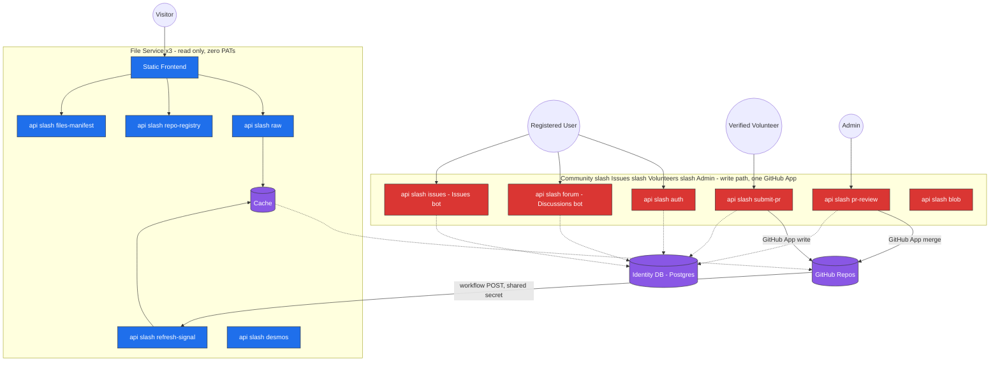
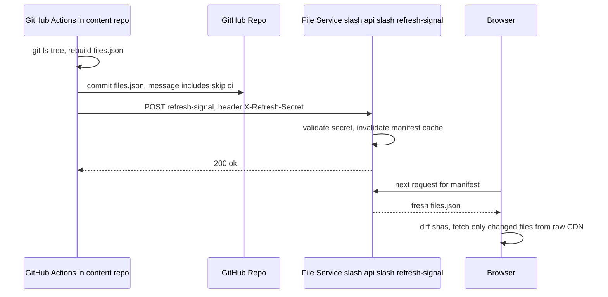

# NoteBooks-Project — Unified Architecture (Consolidated)

> Supersedes `FILE-SERVICE-ARCHITECTURE.md` and `COMMUNITY-VOLUNTEER-ADMIN-ARCHITECTURE.md`.
> This pass: (1) merges both docs into one reference, (2) locks in six decisions that were
> previously open questions, (3) resolves a naming/terminology drift between the two source
> docs (see §0.2), (4) adds the `ai-markdown-parser` tool design that was previously out of
> scope, (5) adds a production-readiness pass (§10) so this is launchable, not just designed.
>
> Standing assumption carried forward unchanged: "science, community, humanities" in the
> original ask is read as **Science, Commerce, Humanities** — Community is this doc's own
> subdomain name, so it's treated as a slip, not a fourth subject stream. Still unconfirmed —
> flag it if wrong.

---

## 0. What Changed This Pass

### 0.1 Six decisions, now locked


| # | Was open in          | Decision                                                                                                                                                                                                                                                         |
| --- | ---------------------- | ------------------------------------------------------------------------------------------------------------------------------------------------------------------------------------------------------------------------------------------------------------------ |
| 1 | File-Service §17 Q1 | **Bot identity is a GitHub App**, not a PAT on a bot account. Higher rate ceiling (~15k/hr vs 5k/hr), scoped permissions, not tied to a human account.                                                                                                           |
| 2 | File-Service §17 Q2 | **Discussions power the forum; Issues handle suggestions, problem reports, and upgrade requests.** Takedown/content-flag reports are folded into the same Issues repo rather than a separate queue — see §0.3 for the one caveat.                              |
| 3 | File-Service §17 Q3 | **One shared `notebooks-community` repo** for the whole forum — not per-subject.                                                                                                                                                                                |
| 4 | Community §12 Q1    | **Overall Admin sits strictly above** Subject Admins and Technical Admin.                                                                                                                                                                                        |
| 5 | Community §12 Q2    | **Identity store is Postgres-class** (Neon/Supabase-class, serverless).                                                                                                                                                                                          |
| 6 | Community §12 Q3    | **`ai-markdown-parser` tooling is in scope.** Volunteers use Claude with maintained, versioned `SKILL.md` files to convert photographed material to structured Markdown — and the skill files themselves are volunteer-improvable via PR. Full design in §7.3. |

### 0.2 A naming drift between the two source docs, resolved here

The File-Service doc's own env-var table used `UPSTASH_REDIS_REST_URL` / `UPSTASH_REDIS_REST_TOKEN`;
the Community doc used a generic `REDIS_URL`. These were describing the same cache. This doc
standardizes on the Upstash REST pair (§9) since that's what a serverless Redis deployment
actually needs — a URL alone isn't sufficient for the REST client.

The File-Service doc also referred to Community/Issues/Volunteers/Admin collectively as a single
"Auth+Volunteer Service" (its own diagram, §3 there). The Community doc later specified these as
**four separately-deployed subdomains** sharing one identity DB, not one service. This doc uses
the four-subdomain framing throughout (§3's diagram is updated accordingly) — the old singular
"Auth+Volunteer Service" name is retired.

### 0.3 One flagged interpretation, not fully closed

Your answer confirms Issues handles suggestions/upgrade requests. It doesn't explicitly say
whether **takedown reports on already-merged content** (an open item in the original Content
Policy Checklist, §10.4 here) should live in that same public Issues repo or be routed
somewhere admin-only. Default applied: same repo, a `takedown` label, visible like any other
issue. If takedown reports need to stay private (e.g. someone reporting content about a real
person, or a legal complaint), that needs a separate, non-public channel instead — flag it and
this gets a different design.

**Update — resolved this pass:** confirmed fully public, plus a real governance flow instead of
one admin deciding alone. See §0.4 and §5.1.

### 0.4 Round two: governance, licensing, interactive content


| #                    | Decision                                                                                                                                                                                                             |
| ---------------------- | ---------------------------------------------------------------------------------------------------------------------------------------------------------------------------------------------------------------------- |
| Takedown governance  | A**Content Committee** (Subject Admins + Overall Admin, to start) rules on takedowns and disputed content — not one admin acting alone.                                                                             |
| Public deliberation  | New Discussions category in`notebooks-community` — **"Takedowns & Policy"** — where anyone can weigh in before the Committee decides.                                                                              |
| Licensing            | **GPL-3.0**, applied uniformly to code and content (notes, question banks) across every repo.                                                                                                                        |
| Takedown visibility  | **Fully public**, confirmed — nothing runs behind closed doors.                                                                                                                                                     |
| Interactive markdown | New capability: a curated set of interactive blocks (quiz, flashcards, accordion, Desmos embed) volunteers — and Claude, via the`ai-markdown-parser` skill — can drop into a note's Markdown. Full design in §12. |

---

## 1. System Overview

Seven sections, one domain (`notebooks-project.vercel.app`), split into two trust zones: three
always-anonymous, read-only **File Service** sections (one per subject), and four
account-bearing sections — **Community, Issues, Volunteers, Admin** — that share one identity
layer. ("Subdomain" is used loosely elsewhere in this doc for these same sections — see the
routing note below for what actually changed.)

**Routing changed this pass — path-based, not subdomain-based, per your call:**


| Path                                      | Purpose                                          | Accounts                 | Trust zone |
| ------------------------------------------- | -------------------------------------------------- | -------------------------- | ------------ |
| `notebooks-project.vercel.app/science`    | File Service — Science                          | None, always anonymous   | Read-only  |
| `notebooks-project.vercel.app/commerce`   | File Service — Commerce                         | None, always anonymous   | Read-only  |
| `notebooks-project.vercel.app/humanities` | File Service — Humanities                       | None, always anonymous   | Read-only  |
| `notebooks-project.vercel.app/community`  | Forum (GitHub Discussions)                       | Registered               | Write path |
| `notebooks-project.vercel.app/issues`     | Suggestions / problem reports / upgrade requests | Registered               | Write path |
| `notebooks-project.vercel.app/volunteers` | Verified fieldwork, PR submission                | Verified + mandatory 2FA | Write path |
| `notebooks-project.vercel.app/admin`      | Review/merge, moderation, task assignment        | GitHub OAuth             | Write path |

Still seven separately-deployed pieces (§4.7 unchanged) — Vercel rewrites at the edge (or a
Next.js multi-zones setup) route each path prefix to its own underlying deployment. Only the
URL a visitor sees changes; TLS/HSTS simplifies to one certificate/policy for the whole domain,
and CSP still gets set per response so each section keeps its own.

**One real tradeoff, stated plainly:** the old subdomain scheme gave browser-enforced origin
isolation — a script running on `science.` genuinely could not touch an `admin.` session cookie,
different origins. On one shared domain, a cookie scoped `Path=/admin` still only *attaches* to
requests targeting `/admin/...` — but a script running anywhere on the domain, including File
Service (the one place less-trusted content lives, §4.6, §12), can still *issue* that request
and have the cookie ride along. §4.6's sanitization and §12.4's iframe sandbox are now the main
thing standing between a File Service slip and the write-path's sessions, not a second,
independent wall.

**Two cheap mitigations, applied as default going forward:**

- Session cookies: `HttpOnly`, `SameSite=Strict`, `Secure`, `Path=`-scoped per section.
- CSRF tokens (double-submit or synchronizer pattern) on every state-changing endpoint in
  Community/Issues/Volunteers/Admin — the piece that actually matters once the origin wall is
  gone.

Flag if this tradeoff isn't acceptable — reverting to subdomains fixes it fully; a middle option
is keeping File Service (the anonymous, less-trusted side) on its own subdomain while only
consolidating the four write-path sections under one domain/path scheme.

Each subject's File Service does its own multi-repo aggregation across that subject's content
repos (e.g. Science merges Biology + Chemistry + Physics + Geology) but never aggregates across
streams. Community/Issues/Volunteers/Admin remain single, unified deployments shared across
all three streams — that's the one place a "one deployment, not three" goal actually lives.

---

## 2. RBAC Tier Model


| Tier                   | Subdomain access                                   | Requirements                                    | Capabilities                                                                                                                               |
| ------------------------ | ---------------------------------------------------- | ------------------------------------------------- | -------------------------------------------------------------------------------------------------------------------------------------------- |
| **Public**             | File Service only                                  | None                                            | Browse/search/read                                                                                                                         |
| **Registered**         | `community`, `issues`                              | Local account (email/password + JWT)            | Post/reply in the forum, file issues and suggestions                                                                                       |
| **Verified Volunteer** | `volunteers` (+ Registered access)                 | Local account, mandatory 2FA, admin appointment | Assigned fieldwork; submits via PR into`volunteer-repo`; belongs to one or more of `school-notes`, `reference-books`, `ai-markdown-parser` |
| **Moderator**          | Elevated on`community` + `issues`                  | GitHub OAuth                                    | Lock/pin/delete forum content, triage and close issues — no PAT, no repo-creation                                                         |
| **Subject Admin**      | `admin`, scoped to Science / Commerce / Humanities | GitHub OAuth + PAT (via GitHub App)             | Assign volunteer work, review/merge PRs within their subject, review PRs to their subject's`notebooks-project-skills` folder               |
| **Technical Admin**    | `admin`, infra-scoped                              | GitHub OAuth + PAT                              | Repo automation, LFS/sharding, service health, deployments — a parallel lane, not ranked against subject admins                           |
| **Overall Admin**      | `admin`, top of hierarchy                          | GitHub OAuth + PAT                              | **Confirmed strictly above** subject and technical admins; final authority; owns the shared `notebooks-project-skills/common` folder       |

---

## 3. Identity, Auth & Shared Dependencies

Community, Issues, Volunteers, and Admin genuinely need to agree on one live thing: who someone
is and what they're allowed to do right now. That can't be re-derived from GitHub the way file
content can, so it's the one deliberate exception to "everything is decoupled."

**Identity store — confirmed Postgres-class** (Neon/Supabase-class, serverless, fits the rest
of the stack). Redis stays for sessions, rate-limiting, and ephemeral caches — never for roles,
2FA secrets, or the admin hierarchy.

**What it holds:** `users` (id, email, password hash, role, 2FA secret + backup codes),
`volunteer_groups` (school-notes / reference-books / ai-markdown-parser membership),
`admin_hierarchy` (subject scope, rank), `appointments` (who appointed whom, when).

**Cross-subdomain sharing without coupling:** JWTs are stateless, signed with one shared
`JWT_SECRET` — any subdomain verifies a session independently, no live service-to-service call.
The identity DB connection is the one genuinely shared runtime dependency, which is normal (one
source of truth for "who is this"), not a decoupling violation.


| Tier                           | Auth mechanism                                                                                                                                                   |
| -------------------------------- | ------------------------------------------------------------------------------------------------------------------------------------------------------------------ |
| Registered, Verified Volunteer | Local email/password, JWT session. Volunteers additionally require TOTP 2FA (standard authenticator-app enrollment + backup codes) before`volunteers` is usable. |
| Moderator, Admin (all three)   | GitHub OAuth — ties moderation/admin identity to the same GitHub accounts already doing PR review.                                                              |

**Bot identity — confirmed GitHub App**, distinct from the OAuth App above (OAuth = human login;
GitHub App = machine identity for automated writes). One installation powers content PR
automation, forum posting (Discussions), the Issues bot, `submit-pr`, and admin merge/moderation
actions — and therefore shares **one** rate ceiling (~15k/hr), not one per subdomain. All
GitHub API calls across every service go through a single shared rate-limit-aware client/queue,
not each subdomain assuming it owns the full quota — the source of "mysterious 429s" otherwise.



The only edge crossing the FS/WP boundary is `GH -->|workflow POST| REFRESH` — never a direct
service-to-service call.

---

## 4. File Service (subdomains 1a–1c)

### 4.1 Purpose & Principles

Serve published study material to anyone, fast, without ever holding a credential that could
write to anything.


| Principle                           | Meaning here                                                                                                                  |
| ------------------------------------- | ------------------------------------------------------------------------------------------------------------------------------- |
| No PATs, no write credentials       | Only unauthenticated reads against a public GitHub repo, via the raw CDN.                                                     |
| Performance over security hardening | Nothing sensitive lives here, so effort goes into caching and latency, not auth middleware.                                   |
| Decoupled by design                 | Never calls the write-path subdomains directly. The only crossing is a secret-authenticated POST: "content changed, refresh." |

### 4.2 Content Delivery

`raw.githubusercontent.com` for everything — manifest and file bytes alike. `api.github.com` /
Octokit are dropped from this service entirely:

```
Manifest:  https://raw.githubusercontent.com/{owner}/{repo}/{branch}/files.json
File body: https://raw.githubusercontent.com/{owner}/{repo}/{branch}/{path}
```

### 4.3 Manifest System

Each content repo carries its own `files.json` at its root, schema-versioned so a format change
never silently breaks a client holding a stale cached copy:

```json
{
  "schemaVersion": 1,
  "commit": "<full 40-char git sha of HEAD at generation time>",
  "generatedAt": "<ISO 8601 timestamp>",
  "tree": {
    "type": "folder", "name": "root", "children": [
      { "type": "folder", "name": "Biology", "path": "Biology", "children": [
        { "type": "file", "name": "Chapter-1-notes.md", "path": "Biology/Chapter-1-notes.md",
          "sha": "<git blob sha>", "size": 4213, "lastModified": "2026-06-02T10:14:00Z" }
      ]}
    ]
  }
}
```

`sha` drives diff-based client sync; `lastModified` (from `git log -1 --format=%cI`, fully
local, no API call) powers the "last updated" feature (§4.5).

**Legacy fallback:** a `files.json` missing `schemaVersion` is treated as `schemaVersion: 0`.
`repo-registry.ts` normalizes it server-side — merged into the tree as before, flagged
internally as "no known prior sha" so the client does one full fetch for that repo, then gets
incremental diffing from then on. The client never has to know a repo is on the old schema.

**Generator lives in each content repo, not this codebase** (e.g. `fsr-science/NCERT-Science`):
`scripts/generate-manifest.js` runs `git ls-tree -r HEAD` locally (no `api.github.com` call,
ever) plus `git log -1 --format=%cI -- <path>` per file. `.github/workflows/manifest.yml` runs
it on push to `main`, commits `files.json` with `[skip ci]`, then POSTs to
`/api/refresh-signal`.

### 4.4 Refresh Pipeline

Not a native GitHub repo-webhook — a plain POST from the content repo's own workflow,
authenticated by a shared app-level secret (not a GitHub PAT, grants no GitHub access).



```
POST /api/refresh-signal
Headers: X-Refresh-Secret: <shared secret, env var on both sides>
Body (optional): { "repo": "owner/repo", "branch": "main", "commit": "<sha>" }
200 { "ok": true, "invalidated": ["owner/repo"] }
401 { "error": "invalid secret" }
```

No `Access-Control-Allow-Origin` header on this endpoint at all, rejects everything but `POST` —
a leaked secret still can't be exploited from a browser context, only server-to-server.

### 4.5 Client Runtime

Read-only reference material — "concurrently working with many notes" means viewing several at
once, not collaborative editing. No conflict resolution needed anywhere here.


| Layer                      | Stores                                      | Purpose                               |
| ---------------------------- | --------------------------------------------- | --------------------------------------- |
| In-memory (JS Map)         | Parsed/rendered AST for open tabs           | Instant re-render on tab switch       |
| IndexedDB                  | Full corpus content, keyed by`path` + `sha` | Full-preload store; offline reading   |
| Service Worker (Cache API) | HTTP responses for manifest + raw requests  | Stale-while-revalidate; PWA/offline   |
| File Service edge cache    | Manifest, local-dev fallback                | Resilience; busted by §4.4's webhook |

Sync is diff-based (compare cached `sha` to manifest's current `sha`). **Bandwidth safeguard:**
checks `navigator.connection.saveData` / `effectiveType`; on slow/metered connections, falls
back to fetch-on-open instead of eager preload.

Multi-file tabs + split panes (VS Code–style dragging), persistent always-visible sidebar,
`openFiles`/`panes` state persisted to `localStorage` (paths/layout only — content re-reads from
IndexedDB, network fallback only if that entry is missing).

**Additional features, all built on the same tree + preload:** client-side full-text search
(`public/search.js`, Web Worker, MiniSearch, rebuilt incrementally per manifest diff);
deep-linkable multi-pane state in the URL; Cmd/Ctrl+P quick-open + tab-cycling shortcuts;
"last updated" per note from `lastModified`; related-notes panel (sibling files, pure frontend);
print/export-to-PDF via `window.print()`.

### 4.6 Reliability & Security

- **Rate limiting:** `src/lib/rate-limit.ts`, per-IP token bucket on every `/api/*` route.
  `/api/refresh-signal` gets its own tighter limit plus the CORS lockdown from §4.4 — the one
  endpoint that mutates server state.
- **HTML sanitization:** Markdown → HTML render pipeline (`md-init.js`) runs markdown-it output
  through DOMPurify before DOM injection — PR review is a gate, not a guarantee, and content is
  public.
- **Manifest fetch fails:** serve last-known-good from IndexedDB/Service-Worker cache with a
  "showing cached version" indicator, not a blank tree.
- **File 404s mid-session** (renamed/removed upstream): affected pane shows "this note was
  moved or removed — refresh the tree" instead of failing silently.
- **IndexedDB quota exceeded:** catch, downgrade gracefully to fetch-on-open for the remainder,
  surface a one-line notice — never a hard preload failure.

### 4.7 Deployment Shape

**Three separate deployments, one per subject** (Science, Commerce, Humanities) — each does its
own internal multi-repo aggregation across that subject's content repos, never across streams.
This is the one place the "one platform" framing was deliberately reversed: it holds one level
up, at Community/Issues/Volunteers/Admin, not here.

**Routing (updated this pass):** all seven deployments now sit behind one domain at path
prefixes (§1) instead of subdomains, via Vercel rewrites at the edge (or Next.js multi-zones).
Each rewrite target still points at its own independently-built, independently-scaled project —
nothing about what gets built or how it scales changed, only the routing layer in front of it.
See §1 for the cookie/CSRF tradeoff that comes with dropping subdomain isolation.

### 4.8 File Manifest (implementation checklist)


| Layer                        | Status   | File(s)                                                                                                                                                                                                                                           | Note                                                                                              |
| ------------------------------ | ---------- | --------------------------------------------------------------------------------------------------------------------------------------------------------------------------------------------------------------------------------------------------- | --------------------------------------------------------------------------------------------------- |
| Frontend                     | Kept     | `index.html`, `public/style.css`, `public/markdown.js`, `public/obsidian-markdown-it.js`, `public/mobile.js`, `manifest.json`, `offline.html`, `src/service-worker.ts`, `src/client/main.ts`, `public/fonts/*`, `favicon.png`                     | Unchanged                                                                                         |
| Frontend                     | Modified | `public/app.js`                                                                                                                                                                                                                                   | Its one auth touchpoint becomes a link out to the Volunteers/Admin subdomain, no inline logic     |
| Frontend                     | Modified | `public/md-init.js`                                                                                                                                                                                                                               | Gains DOMPurify sanitization step (§4.6)                                                         |
| Backend                      | Modified | `src/api/raw.ts`                                                                                                                                                                                                                                  | Drops Octokit/Contents-API branch entirely; always builds a raw-CDN URL. Local-dev fallback kept. |
| Backend                      | Modified | `src/api/repo-registry.ts`                                                                                                                                                                                                                        | Merge logic unchanged; manifest source now uniformly raw CDN                                      |
| Backend                      | Modified | `src/api/refresh-signal.ts`                                                                                                                                                                                                                       | Validates`X-Refresh-Secret`, no CORS headers, rate-limited                                        |
| Backend                      | Modified | `src/server/server.ts`                                                                                                                                                                                                                            | Only mounts`raw`, `repo-registry`, `refresh-signal`, `files-manifest`, `desmos`                   |
| Backend                      | Modified | `src/api/_shared.ts`                                                                                                                                                                                                                              | Trimmed to repo-config parsing only; Octokit helper moves to the write-path services              |
| Backend                      | Kept     | `src/api/files-manifest.ts`, `src/api/desmos.ts`                                                                                                                                                                                                  | Local-dev fallback; read-only API-key proxy                                                       |
| New                          | Added    | `src/lib/rate-limit.ts`, `public/search.js`, `public/content-store.js`, `public/tabs.js`                                                                                                                                                          | §4.5, §4.6                                                                                      |
| New (content repo)           | Added    | `scripts/generate-manifest.js`, `.github/workflows/manifest.yml`                                                                                                                                                                                  | §4.3 — lives in each content repo, not this codebase                                            |
| Removed                      | Dropped  | `public/gh-proxy.js`                                                                                                                                                                                                                              | Already self-marked`DEPRECATED`; dead code                                                        |
| Removed                      | Dropped  | `src/api/pages-fetch.ts`                                                                                                                                                                                                                          | `pages:true` special case replaced by uniform raw-CDN manifest fetch                              |
| Removed                      | Dropped  | Octokit dependency (`package.json`)                                                                                                                                                                                                               | No longer used anywhere in this service                                                           |
| Moves to write-path services | —       | `auth.ts`, `gh.ts`, `submit-pr.ts`, `pr-review.ts`, `forum.ts`, `blob.ts`, `public/auth.js`, `public/modern-auth.js`, `public/community.js`/`.css`, `public/admin-terminal.js`, `public/upload.js`, `public/markdown-editor.js`, `installer.html` | Not detailed further in this doc                                                                  |

### 4.9 Migration / Cutover Plan

1. Dark-launch both new deployment groups on their new domains, no traffic cut yet.
2. Backfill manifests: run the updated generator once against every content repo so
   `files.json` has `schemaVersion` before any client relies on it.
3. Point the new File Service at real content, verify raw-CDN read path + refresh pipeline
   end-to-end on the new domain only.
4. Stand up Community/Issues/Volunteers/Admin on their own domains, carrying over the JWT
   signing secret and Redis data if current sessions should survive the cut — otherwise clean
   cutover, users re-login once.
5. Update the old monolith's outbound links (or DNS/edge redirects) so content paths point to
   File Service and auth/forum/submission paths point to the new subdomains.
6. Let in-flight PRs finish under whichever service ends up holding the write path before
   decommissioning the old system.
7. Cut over DNS during a low-traffic window; watch `/api/health` and function logs closely for
   24–48 hours.
8. Burn-in period (1–2 weeks) running both old and new in parallel if feasible, before
   decommissioning. Freeze the old repo as a forensic reference, same as `ARCHITECTURE.md`
   already treats the pre-split system.

### 4.10 Operational Numbers & Monitoring


| Setting                            | Value                                                                                       | Why                                              |
| ------------------------------------ | --------------------------------------------------------------------------------------------- | -------------------------------------------------- |
| Rate limit — general`/api/*` GET  | 120 req/min per IP, burst 20                                                                | Generous but bounds scripted abuse               |
| Rate limit —`/api/refresh-signal` | 10 req/min per IP                                                                           | Only ever hit by one workflow                    |
| Raw file proxy`Cache-Control`      | `public, max-age=300, stale-while-revalidate=3600`                                          | SWR so a cache miss isn't a cold fetch           |
| Manifest edge-cache TTL            | 5 minutes                                                                                   | Safety net only — webhook invalidates instantly |
| IndexedDB full-preload soft cap    | ~200 MB estimated corpus, via`StorageManager.estimate()`                                    | Above this, fall back to per-subject preload     |
| Search index rebuild               | Incremental patch within ~2s of a manifest diff; full rebuild only on`schemaVersion` change | Keeps search fast without full reindex           |

**`GET /api/health`** — returns manifest cache age and timestamp of the last successfully
processed refresh-signal, so an uptime check can alert if a content repo has commits but no
refresh landed in an unexpectedly long window. **Baseline monitoring:** Vercel's built-in
function logs/analytics, plus minimal `window.onerror`/`unhandledrejection` handlers posting a
PII-free error summary. A dedicated error-tracking tool is worth layering in later if volume
warrants it — not a launch blocker for a free/public project this size.

---

## 5. Community Subdomain

**Confirmed: one shared `notebooks-community` repo**, not per-subject. Built on GitHub
Discussions, categories mapping to Science/Commerce/Humanities plus general discussion. The bot
posts on behalf of local accounts; since GitHub only ever shows the bot as author, each post
embeds a small machine-parseable marker (username, avatar URL, timestamp) that the frontend
strips and re-renders as proper attribution — GitHub's native author field is never shown to
users.

Moderators (GitHub OAuth) get native lock/pin/delete via the same bot, scoped to
moderation-only permissions — never PAT-level repo-creation or merge rights.

### 5.1 Governance: Content Committee & Public Policy Channel

Takedown decisions and disputed-content calls aren't made unilaterally by whichever admin
happens to pick up the issue. **Content Committee = all Subject Admins + Overall Admin.**
Composition can grow later (e.g. rotating community seats) if the project wants review to be
less admin-only over time — noted as a future option, not a blocker now.

**New Discussions category: "Takedowns & Policy"** in `notebooks-community` — where anyone, not
just committee members, can weigh in on a takedown request, propose a moderation-policy change,
or raise a licensing question, before the Committee posts a decision. This is the
public-deliberation layer a bare Issues label doesn't provide on its own.

**Flow:** a `takedown`-labeled issue in `notebooks-project-suggestions` (§6) gets a linked
thread in this category, posted by the bot using the same attribution-marker pattern as regular
forum posts (§5). Discussion happens publicly; the Content Committee posts the resolution as a
pinned reply; the original issue is closed referencing that reply. Nothing about the decision or
the deliberation is private.

---

## 6. Issues Subdomain

**Confirmed: GitHub Issues, in a dedicated `notebooks-project-suggestions` repo, cover
suggestions, problem reports, and upgrade requests** — a good semantic fit since Issues are
naturally a trackable-ticket model. Moderators triage/close; Subject Admins escalate into
actual work. Takedown reports on already-merged content are folded into the same repo with a
`takedown` label, publicly deliberated via the Content Committee's Discussions channel (§5.1)
rather than resolved behind the scenes — confirmed fully public per your call (§0.4).

**Internal volunteer task tracking is a separate, distinct thing** despite sharing the word
"issues" — assignments live in their own `notebooks-project-tasks` repo, not mixed into the
public suggestions repo, since one is public input and the other is internal work management
with a different audience.

---

## 7. Volunteers Subdomain

Real-world fieldwork: gathering teachers' notes, photographing question banks, parsing that
material into Markdown, AI-assisted.

### 7.1 Groups & Assignment


| Group                | Work                                                                |
| ---------------------- | --------------------------------------------------------------------- |
| `school-notes`       | Gathering notes directly from teachers                              |
| `reference-books`    | Sourcing/scanning reference material                                |
| `ai-markdown-parser` | Turning photographed material into structured Markdown, AI-assisted |

An account can belong to more than one group. Work assignment reuses the Issues-as-tracker
pattern internally: a Subject Admin opens an assignment as a GitHub Issue in
`notebooks-project-tasks`, assigned to a specific verified volunteer or open to their group.

### 7.2 Submission Flow

Same PR-based pattern as content submission elsewhere — targeting `volunteer-repo` instead of a
subject content repo, gated by the Verified Volunteer tier (2FA required). The volunteer's PR
references and closes the assignment issue on merge — assignment, in-progress, and completion
all stay visible in one place, no custom task-tracking backend needed.

### 7.3 `ai-markdown-parser`: Claude + SKILL.md Tooling *(new this pass)*

**What it is:** volunteers in this group use Claude — their own access, whatever surface they
have (claude.ai, Claude Code, Claude Cowork) — together with a maintained `SKILL.md` file that
encodes the house conventions for turning a photographed question bank or note set into clean,
structured Markdown: heading levels, question/answer tagging, math formatting compatible with
this project's renderer, image/figure handling, and the front-matter fields the manifest
generator (§4.3) expects. As of §12, that same skill can also emit a small set of interactive
blocks (quiz, flashcards, accordion, Desmos embed) directly into the generated Markdown wherever
the source material calls for it — see §12.3.

**Where the skill files live:** a new, dedicated `notebooks-project-skills` repo — deliberately
**not** inside `volunteer-repo`, to avoid entanglement with that repo's LFS sharding (§7.4);
skills are small text files with no reason to be duplicated or fragmented across shards.
Structure:

```
notebooks-project-skills/
  science/SKILL.md
  commerce/SKILL.md
  humanities/SKILL.md
  common/SKILL.md        (cross-subject conventions)
```

**Who can change them:** any Verified Volunteer opens a PR against a subject folder or `common/`
to propose a new or improved skill. The relevant Subject Admin reviews/merges subject folders;
Overall Admin owns `common/` since it's cross-subject. This is the same review lane already
granted in §8 (Admin subdomain) — an added target repo, not a new capability.

**Why this shape:**

- **Zero new backend or infra.** No `ANTHROPIC_API_KEY`, no hosted inference cost, no new
  endpoint — it's the volunteer's own Claude usage, not a service this project runs and pays
  for. Consistent with the git-native, decoupled philosophy used everywhere else in this project.
- **Self-improving without a dedicated engineering track.** The skill files are living
  documents, improved by ordinary PR review exactly like content — quality compounds the same
  way the notes corpus does.
- **Doubles as informal AI/prompting literacy** for volunteers, which was the stated intent —
  they're not just consuming a fixed tool, they're learning to read, critique, and improve a
  prompt/skill spec as part of doing the work.

**Submission, unchanged:** the finished `.md` (plus the source PDF via Git LFS, §7.4) goes into
the volunteer's normal PR into `volunteer-repo-NN`, closing the assignment issue — no change to
the flow in §7.2.

**Flagged assumption:** this assumes volunteers bring their own Claude access rather than the
project hosting an in-app "upload PDF, get Markdown" tool. If it should instead be a built-in
feature of the `volunteers` subdomain (server-side API calls), that's a materially heavier
design — needs `ANTHROPIC_API_KEY`, per-volunteer usage/cost caps, and a new backend endpoint.
Flag if that's actually what's wanted; happy to spec it either way.

### 7.4 `volunteer-repo`: PDF Storage, LFS, and Auto-Sharding

Photographed question-bank PDFs are exactly what plain git handles badly — large binaries
bloat history fast, GitHub's practical size ceilings arrive sooner than expected from scans.

- **Git LFS from day one.** Externalizes the bytes, keeps lightweight pointers in git. Watch
  GitHub's LFS free-tier storage/bandwidth limits per repo — the first ceiling to plan around,
  ahead of repo size itself.
- **PAT-driven auto-repo-creation once a shard fills.** The Technical Admin's GitHub App
  (`admin:org` / repo-creation scope) creates `volunteer-repo-02`, `-03`, etc. as each shard
  nears its ceiling. `volunteer-repo-index.json` (fetched via raw CDN, no live API call) tracks
  which shard is current and lists prior shards.
- **Requires org-level repo-creation** under the `fsr-official` GitHub org — confirm that's
  still the intended home; a personal-account PAT can't create org repos the same way.

---

## 8. Admin Subdomain

**Confirmed hierarchy:** Overall Admin strictly above Subject Admins (Science, Commerce,
Humanities, peers under it, each scoped to their own subject's content review and volunteer
assignment) and Technical Admin (a parallel, non-ranked lane handling infra — LFS/sharding,
deployments, bot/service health — rather than content).

**Capabilities:** PR review/merge (all streams for Overall Admin, own subject for Subject
Admins, including their `notebooks-project-skills` folder per §7.3); volunteer task assignment
(§7.1); repo auto-creation (§7.4); forum/issue moderation escalation beyond what a Moderator can
do.

---

## 9. Environment Variables (master list)


| Variable                                                                | Used by                                          | Purpose                                                                                                                  | Status                             |
| ------------------------------------------------------------------------- | -------------------------------------------------- | -------------------------------------------------------------------------------------------------------------------------- | ------------------------------------ |
| `JWT_SECRET`                                                            | Community, Issues, Volunteers, Admin             | Shared stateless session verification                                                                                    | Confirmed                          |
| `IDENTITY_DB_URL`                                                       | Community, Issues, Volunteers, Admin             | Postgres identity store (§3)                                                                                            | Confirmed                          |
| `UPSTASH_REDIS_REST_URL`, `UPSTASH_REDIS_REST_TOKEN`                    | All four write-path subdomains                   | Sessions, rate-limiting, ephemeral caches                                                                                | Standardized this pass (§0.2)     |
| `GITHUB_APP_ID`, `GITHUB_APP_PRIVATE_KEY`, `GITHUB_APP_INSTALLATION_ID` | Volunteers, Admin, Community (bot), Issues (bot) | Confirmed GitHub App bot identity (§3)                                                                                  | Confirmed, scope widened this pass |
| `GITHUB_OAUTH_CLIENT_ID`, `GITHUB_OAUTH_CLIENT_SECRET`                  | Community (mods), Issues (mods), Admin           | Human login for moderators/admins — distinct from the GitHub App above                                                  | Confirmed                          |
| `TOTP_ISSUER_NAME`                                                      | Volunteers                                       | 2FA enrollment display name                                                                                              | Confirmed                          |
| `RESEND_API_KEY`                                                        | Community, Issues, Volunteers                    | Password reset / notification emails                                                                                     | Confirmed                          |
| `RECAPTCHA_SECRET_KEY`                                                  | Community, Issues, Volunteers                    | Registration spam protection                                                                                             | Confirmed                          |
| `BLOB_READ_WRITE_TOKEN`                                                 | Volunteers                                       | Submission attachment uploads                                                                                            | Confirmed                          |
| `COMMUNITY_REPO`                                                        | Community                                        | `owner/repo` of `notebooks-community`                                                                                    | Confirmed                          |
| `GITHUB_WEBHOOK_SECRET`                                                 | Community, Issues                                | Validates GitHub's native Discussion/Issue webhooks for forum/issues cache invalidation — distinct from`REFRESH_SECRET` | Confirmed                          |
| `REFRESH_SECRET`                                                        | File Service (all 3)                             | Validates the workflow-initiated POST to`/api/refresh-signal`                                                            | Confirmed                          |
| `DESMOS_API_KEY`                                                        | File Service (all 3)                             | Only if the Desmos proxy is used                                                                                         | Optional                           |
| `RATE_LIMIT_GENERAL_RPM`                                                | File Service (all 3)                             | Overrides §4.10 default (120)                                                                                           | Optional                           |
| `RATE_LIMIT_REFRESH_RPM`                                                | File Service (all 3)                             | Overrides §4.10 default (10)                                                                                            | Optional                           |
| `PORT`, `NODE_ENV`                                                      | All                                              | Standard runtime                                                                                                         | Standard                           |

**Notably absent on purpose:** File Service carries no `GITHUB_TOKEN`, no Redis URL, no JWT
secret — zero credentials that grant write access anywhere (§4.1). The `ai-markdown-parser`
tool (§7.3) needs **no new variable** under the default (BYO-Claude) design.

---

## 10. Production-Readiness Checklist

Beyond architecture — what's needed to actually launch, scoped to this project's size (a free,
volunteer-run reference site, not an enterprise system).

### 10.1 Backups & Recovery

- **Postgres (identity store):** rely on the provider's built-in point-in-time recovery
  (Neon/Supabase both offer this) — no separate backup system needed at this scale, just confirm
  it's enabled on the plan you pick.
- **Redis:** cache/session data only, by design (§3) — nothing there is authoritative, so no
  backup needed. Losing it just means re-logins.
- **Git content:** already durable by nature of being git — GitHub is the backup.

### 10.2 Secrets Hygiene

- Store all of §9 in the hosting platform's secret manager (Vercel env vars, or equivalent),
  never in repo. Rotate `JWT_SECRET`, `REFRESH_SECRET`, and `GITHUB_WEBHOOK_SECRET` if ever
  exposed in a log or client bundle by mistake — no scheduled rotation needed for a project this
  size, but have the rotation *path* (re-issue, redeploy, invalidate old sessions) written down
  before launch, not figured out during an incident.
- Password hashing: use a modern adaptive hash (argon2id or bcrypt with a sane cost factor) —
  not explicitly named in either source doc, made explicit here since it's a hard requirement,
  not a nice-to-have.

### 10.3 Staging

- Lean on Vercel preview deployments (already implied by the stack, §4.10) for the four
  write-path subdomains rather than standing up a separate staging environment — a preview
  branch per PR is enough at this scale.
- Content repos: since the manifest generator runs on every push to `main` (§4.3), do one dry
  run against a fork or a throwaway branch before the first real cutover, so a workflow bug
  doesn't fire a bad refresh-signal against production.

### 10.4 Content Policy (what this means: the rules for what content is acceptable, who reviews

disputes, and how takedowns get resolved — a product/governance call, not an architecture one)

- [X]  **Moderation policy / disputed-content process:** contested calls go to the Content
  Committee (§5.1), not one admin deciding alone. The written "what's acceptable" wording itself
  still needs drafting, but the *process* is now defined.
- [X]  **Review process:** Subject Admin reads the PR against the subject's `SKILL.md`
  conventions (§7.3); anything contested escalates to the Content Committee for a public call
  instead of one person's judgment.
- [X]  **Takedown path:** `notebooks-project-suggestions`, `takedown` label, resolved publicly
  through the Content Committee + "Takedowns & Policy" Discussions channel (§5.1, §6). Confirmed
  fully public — no longer a flagged item.
- [X]  **Licensing:** GPL-3.0 across code and content. See §11.
- [ ]  **Turnaround target (proposed default, not yet committed):** acknowledge new
  issues/suggestions within 3–5 days, resolve or explicitly triage-and-defer within 2–3 weeks.
  Fine for a volunteer project to miss occasionally; the point is having a stated number so
  "silence" doesn't become the default experience.

### 10.5 Privacy / Legal-lite

- A short privacy notice / terms page before public registration opens — what's collected
  (email, password hash, submission history), how takedown requests work, that content is
  volunteer-reviewed rather than guaranteed-accurate. Out of scope for this doc to draft, but
  it's a real launch blocker, not optional polish, given the site is aimed at students.

### 10.6 Minimal Testing Before Cutover

- Smoke-test the refresh pipeline end-to-end (§4.4) against one real content repo before
  relying on it for all three streams.
- Smoke-test the auth + 2FA enrollment flow once, since that's the one path with no fallback
  if it's broken at launch (a volunteer literally can't submit anything without it).
- No need to build out a full test suite before launch at this project's scale — these two
  flows are the ones where a silent failure would be hardest to notice.

---

## 11. Licensing

**Confirmed: GPL-3.0 for everything** — code and content (notes, question banks, generated
Markdown) alike. Free to use, copy, and modify, no separate terms for the two.

One honest flag, not a pushback: GPL-3.0 is a *software* copyleft license — its text talks about
"source code" and "compiling." Almost every open content project (Wikipedia, most OER projects)
licenses prose/notes under **CC-BY-SA** instead, specifically because it maps cleanly onto
non-code work and is what downstream reusers (schools, other OER projects) expect to see on
educational material. GPL-3.0 *can* be applied to non-code content — nothing stops it — it's
just unusual, so an unfamiliar reuser might pause on it. Since the actual intent ("free for all,
use it, modify it, don't care about the details") is what matters, GPL-3.0 delivers that fine,
and one license instead of two is simpler. Going with GPL-3.0 across the board, as instructed.

**Implementation:**

- `LICENSE` file (GPL-3.0 full text) at the root of every repo: each subject's content repos,
  `volunteer-repo-NN` shards, `notebooks-community`, `notebooks-project-suggestions`,
  `notebooks-project-tasks`, `notebooks-project-skills`.
- A one-line footer on every rendered note in the File Service frontend — "Content licensed
  under GPL-3.0" linking to the license text — so terms are visible to readers, not buried in a
  repo file.
- No new env vars or backend changes — static-file and UI addition only.

---

## 12. Interactive Elements in Markdown

Two different things were being asked about, worth separating:

- **Inline chat (this conversation):** when something interactive renders here — a diagram, a
  small calculator — that's a chat-only tool. It produces nothing saved to a repo and has no
  connection to your site's own rendering pipeline.
- **Inside your actual Markdown files, served to real visitors** — a genuinely new capability
  this project didn't have. Designed below.

### 12.1 Why not just allow raw HTML/JS in a note

The renderer already runs every note through DOMPurify (§4.6) specifically because content is
public, volunteer-authored, and PR-reviewed but still web-facing — review is a gate, not a
guarantee. If arbitrary `<script>` were allowed in a merged note, every successfully-reviewed PR
becomes a permanent stored-XSS risk across all three subject sites, since one missed review is
all it takes. That risk doesn't disappear because review exists — it's exactly what DOMPurify is
there to catch. So: no raw script in content, full stop. Interactivity instead comes from a
small, fixed, developer-reviewed component library — notes supply *data*, never *code*.

That said, "no raw HTML ever" is the wrong lesson to take from this — there's a way to keep the
full, freeform, generated-visual richness you're after without reopening the XSS risk. See §12.4.

### 12.2 Mechanism: a curated block syntax

A markdown-it plugin recognizes a small set of fenced directive blocks. Authors — volunteers, or
Claude via the `ai-markdown-parser` skill — write structured data inside; the frontend renders it
with a matching, pre-built vanilla-JS component:

````
```{quiz}
question: What is the SI unit of force?
options: [Newton, Joule, Watt, Pascal]
answer: Newton
```
````

```
```{accordion title="Worked solution"}
Step 1: ...
Step 2: ...
```

```

```

```{desmos expression="y=x^2+2x-3"}

```

```

**Rendering pipeline:** each block becomes a static placeholder (`<div data-block="quiz"
data-payload="...">`) during the same markdown → HTML pass that already runs through DOMPurify —
DOMPurify only ever sees an inert `<div>` with a data attribute, never live script, so §4.6's
sanitization guarantee is unchanged. After sanitization, a small hydration script — part of the
shared frontend bundle, not per-note — scans for `[data-block]` elements and mounts the matching
component. An unrecognized block type, or a payload that fails its schema check, falls back to
plain-text rendering instead of failing silently — same failure-mode pattern as §4.6's others.

**Where the components live:** `public/interactive-blocks/` in File Service (new addition to
§4.8), shared across all three subject deployments since File Service's frontend is common code.
Adding a *new* block type is a PR against File Service itself (infra-level, Technical/Overall
Admin review) — not something a content PR can introduce on its own, since it's code, not data.

**Starter set** (chosen for what a notes/question-bank site actually needs, cheapest to build
first):

| Block | Renders | Note |
|---|---|---|
| `quiz` | MCQ with reveal-answer | Direct fit for question-bank material |
| `flashcards` | Front/back card, click-to-flip | Direct fit for `school-notes` content |
| `accordion` | Collapsible section | Good fit for "show worked solution" patterns |
| `desmos` | Embedded graphing calculator | **Already has backend support** — `src/api/desmos.ts` (§4.2, §4.8) is an existing read-only proxy; this block is mostly wiring |
| `formula-input` | Simple parameterized numeric plug-in (mathjs-backed) | Lower priority, ship after the above four prove the pattern |

### 12.3 How this plugs into `ai-markdown-parser` (§7.3)

Each subject's `SKILL.md` documents the available block syntax and when to reach for each one —
so when a volunteer runs Claude over a photographed question bank, Claude can emit a `{quiz}`
block directly wherever the source material was already a question-with-answer, instead of
flattening it into inert prose. This is the actual mechanism behind "Claude adding interactive
elements to the markdown" — Claude fills in a block's data fields from what it reads in the
source scan; it never writes rendering code, which stays fixed, reviewed, and shared.

**No new secrets or backend surface.** This is a frontend rendering addition plus a
markdown-plugin extension — it doesn't touch §9's env-var list.

### 12.4 Freeform Generated Visuals — the actual chat-widget look, saved to the site

§12.2's blocks are fixed templates: quiz, flashcards, a handful of preset shapes filled with
data. What's actually being asked for is different — a custom, one-off, colorful SVG/HTML
illustration or interactive explainer generated per-topic, the same kind of thing rendered
inline in chat, not a template. That's more open-ended, and it needs a different safety
mechanism than §12.2's — not a ban, a sandbox.

**How it's authored:** during the `ai-markdown-parser` workflow (§7.3), Claude generates a
self-contained SVG or HTML/CSS/JS snippet for a note — the same kind of visual it produces
inline in this conversation — and the volunteer saves it as its own file next to the note (e.g.
`Biology/Chapter-1/visual-1.html`), referenced from the note with:

```

```{visual src="visual-1.html"}

```

```

It goes through the same PR review as everything else — a human looks at the rendered output
before merge, same gate every other note passes through.

**How it's rendered safely:** inside a sandboxed `<iframe sandbox="allow-scripts">` —
deliberately *without* `allow-same-origin`. The embedded content runs its own JS and looks
exactly like the inline-chat version, but it can't read the parent page's cookies or session,
can't call your APIs, and can't break out of its frame. **One more lock added this pass:** the
sandbox attribute alone doesn't stop the iframe making its own outbound network calls (a bad
visual could still `fetch()` to some third party and quietly beacon out, even with zero access
to anything of yours) — so every generated visual's `srcdoc` gets a
`<meta http-equiv="Content-Security-Policy" content="default-src 'none'; style-src
'unsafe-inline'; img-src data:;">` tag injected at render time, before it's mounted. That locks
the visual down to inline styles and inline/data-URI images only — no fetch, no external
scripts, no beaconing anywhere — closing the one gap the sandbox attribute leaves open. A small
`postMessage`
handshake lets the iframe report its content height so it auto-sizes instead of leaving dead
space or a scrollbar.

**Where the asset lives:** alongside the note in the content repo, tracked by the manifest
(§4.3) like any other file — its own `sha`, participates in diff-based sync, fetched from the
raw CDN exactly like everything else. No new backend, no new infra.

**When to use which:** §12.2's fixed blocks for the common, repeatable cases (quiz, flashcards,
Desmos graphs) — cheaper, easier to review, no sandbox needed since there's no arbitrary code.
Reach for a freeform `{visual}` block when a topic genuinely wants a one-off illustration or
interactive explainer that doesn't fit a template — the sandbox is what makes that safe to allow
at all, rather than an all-or-nothing choice between "boring templates" and "no interactivity."

---

## 13. Remaining Open Items

Two of the three items from the last pass are now resolved:

~~Takedown reports: public or private?~~ — resolved, fully public (§0.4, §5.1, §6).
~~Content policy process~~ — resolved, Content Committee + public Discussions channel (§5.1).
~~Licensing~~ — resolved, GPL-3.0 across code and content (§11).

What's left:

1. **"Science, Commerce, Humanities" reading of the original ask** — still an unconfirmed
   assumption carried over from the first draft. Flag if a fourth stream was actually intended.
2. **Turnaround commitment (§10.4)** — a default is proposed (3–5 day ack, 2–3 week
   resolution), but it hasn't been formally signed off.

---

*Next: your call — lock the two items above, or move to detailing one subdomain's actual
endpoint contracts. Volunteers' assignment/submission flow (including the §7.3 skill-review path
and the §12 interactive-block schema) is probably the most involved and the best next target.*
```
