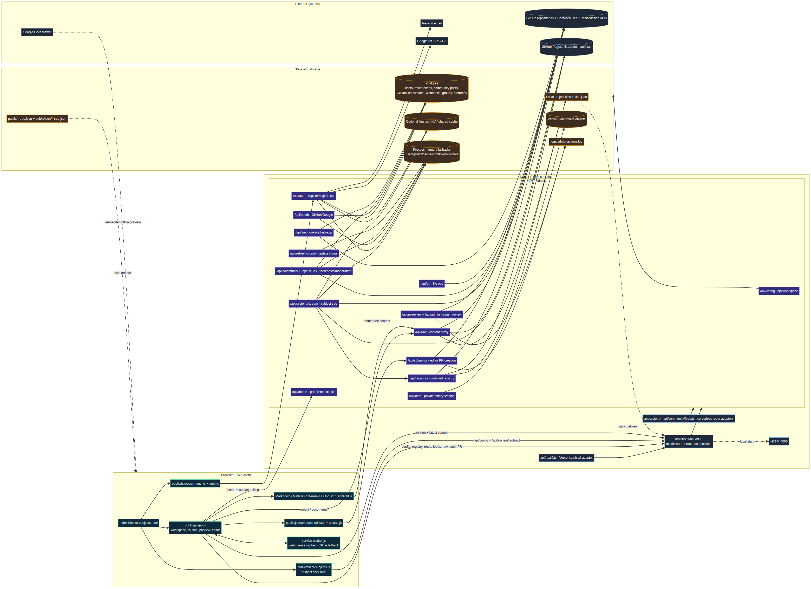

# NoteBooks Framework — Real Current Architecture

**Analysis basis:** attached `project-src.zip` as inspected on **22 August 2026**. This map describes the implementation that is present in the archive, not only the aspirations described in the project README.

> **Executive finding.** The current system is a hybrid, framework-light web application: a vanilla JavaScript/PWA client is served by an Express application, with a Vercel catch-all adapter for serverless deployment. The client presents either a public portal shell or a repository workspace. Workspace trees are assembled from configured GitHub repositories, with generated/static manifests and a local `files.json` tree as fallbacks. GitHub is the primary external content and publication system; Postgres, optional Upstash-compatible KV, and process memory provide progressively weaker persistence tiers for identity, community state, and caching. [1] [2] [3]

## 1. System shape

At runtime there are four meaningful layers:

| Layer | Current implementation | Responsibility |
|---|---|---|
| Browser shell | `index.html`, `public/html/subjects.html`, admin/public HTML shells, vanilla scripts | Navigation, subject portals, repository browsing, previews, Markdown rendering, authentication UI, editor UI, PWA behavior. [3] [4] |
| HTTP/application layer | `src/server/server.ts` and `src/api/*.ts` | Express middleware, route composition, authorization, content proxying, GitHub operations, community moderation, health and update endpoints. [1] |
| State and persistence | Local files, generated JSON, Postgres, optional KV, process memory, Vercel Blob, log files | Content manifests, identity, reset tokens, community posts, cache entries, staged binary uploads, and audit traces. [7] [13] |
| External control plane | GitHub repositories/APIs, GitHub Pages, Resend, reCAPTCHA, Google Docs viewer, browser CDNs | Source content, repository trees, pull requests, discussions, email reset delivery, bot protection, office-document preview, and client libraries. [7] [10] [11] [14] [15] |

The application is not a conventional SPA with a client-side framework. The HTML shells are served directly, and `public/js/app.js` acts as the main browser runtime. Navigation is progressively enhanced with the History API, but the server still owns the initial HTML shell selection. [1] [5]

## 2. Deployment and request entrypoints

The project has two actual server startup paths.

| Deployment path | Entry | Behavior |
|---|---|---|
| Local or long-running Node process | `src/server/server.ts` → `startServer()` | Starts Express on `PORT`, defaulting to `4000`; development defaults are injected for selected variables before app creation. [1] |
| Vercel serverless | `api/[...all].ts` | Creates the Express app once and exports it as the Vercel handler. Additional shims expose selected routes such as `api/system/[stream].ts` and `api/community/feed.ts`. [2] [6] |

The build command performs more than TypeScript compilation. It cleans stale generated JavaScript, generates `version.json`, regenerates the repository registry, regenerates subject trees, then compiles the client and server TypeScript outputs. The generated subject-tree files are therefore build artifacts as well as runtime fallbacks, and the build may depend on repository/Pages availability. [2] [18]

The server adds cross-origin isolation headers, cookie parsing, optional double-submit CSRF enforcement, optional write logging, Helmet CSP, JSON/urlencoded body parsing, metrics middleware, static file serving, and route handlers. The same application serves both the public files and the backend APIs. [1]

## 3. Browser architecture

### 3.1 Shell selection and navigation

The server returns `index.html` for `/`, `subjects.html` for subject and portal routes, and a public admin shell for `/admin`, `/admin/`, and `/admin-prs`. The subject routes include `science`, `commerce`, `humanities`, `community`, `volunteers`, `accounts`, `issues`, and `about`. The shell is selected server-side, then `app.js` switches between the public portal view and the workspace view based on the current route. [1] [5]

`public/js/app.js` is the central client controller. It owns theme persistence, route transitions, subject-tree loading, repository-tree rendering, search/indexing, folder navigation, floating previews, downloads, update polling, and the bridge into the Markdown editor. `public/client/subjects.js` is narrower: it loads a subject tree, renders the subject-specific nested contents tree, and delegates file opening to the existing global `openPreview()` or `openMobilePreview()` functions in `app.js`. [5] [6]

### 3.2 Content rendering

The browser loads Markdown-it and extensions from CDNs, plus MathJax, Mermaid, Highlight.js, TikZJax, and project scripts for Markdown initialization and Obsidian-compatible syntax. Markdown files are fetched as text and rendered in a floating preview window. Images, audio, video, HTML, PDF, and office files use type-specific preview paths; office documents are delegated to Google Docs Viewer. [3] [5]

The client’s source selection is deliberately layered. For repository-backed files, text fetches prefer raw GitHub and jsDelivr, while embedded media and iframe content prefer the same-origin `/api/raw` proxy because the server’s CSP/CORP rules are designed around that proxy. Local files, Pages URLs, and other sources are used as fallbacks. [5] [10]

### 3.3 Editor and publication handoff

The editor is session-oriented in the browser. It stores/retrieves saved content through the Markdown editor module, updates the rendered preview live, validates/sanitizes interactive blocks, and submits changes to `/api/submit-pr`. The server does not directly publish the edited content to the live repository; it creates a branch, commits the file, and opens a pull request for review. [5] [15]

Binary upload staging is separate from Markdown publication. `public/js/upload.js` sends binary data to `/api/blob`, whose handler stores private objects in Vercel Blob and supports authenticated upload, fetch, and delete operations. [9]

## 4. Content architecture

### 4.1 Repository registry

`GITHUB-REPOSITORIES.md` is the primary registry in the checked-in project. It currently maps three enabled repositories to three streams: Science, Commerce, and Humanities, each on `main` with Pages enabled and priorities 1–3. The registry parser supports `name`, `stream`, `repo`, `branch`, `root`, `enabled`, `priority`, and `pages`. A JSON registry is retained as a fallback. [8] [19]

The registry builder creates a combined root tree from the local `files.json` tree and remote repository trees. Remote trees are placed under repository-name folders, paths are annotated with repository and branch metadata, and duplicate repository-relative files are marked with canonical/shadowed metadata using priority ordering. [8]

### 4.2 Subject-scoped tree API

`/api/system/:stream` is the authoritative runtime API for the three workspace subjects. It selects registry entries by explicit stream first, then by `SUBJECT_REPOS`, then by repository-name inference. For each selected repository it attempts to load a `files.json` manifest via the configured Pages path; if that fails, it falls back to the recursive GitHub Git Trees API. Only Markdown/MDX/Markdown-extension files and PDFs are included in the subject tree. [7]

The subject-tree response is cached in two tiers: an in-process map and an optional shared KV cache. Concurrent requests for the same subject are coalesced through an in-flight promise. The normal cache lifetime is five minutes. A signed `POST /api/system/:stream/refresh` invalidates both cache tiers and rebuilds the subject tree. [7]

The client and service worker retain generated/static fallbacks under `/public/json/<subject>-tree.json` and `/public/<subject>-tree.json`. The build script writes both forms. Consequently, the effective read order is:

1. Runtime subject API.
2. Generated subject JSON under `public/json`.
3. Generated subject JSON under `public`.
4. For the broader workspace, `/api/registry` and then local `/files.json`/registry fallbacks.

This is why the deployed system can continue to display an older tree when the live repository API or Pages manifest is unavailable. [5] [6] [7] [18]

### 4.3 File-byte delivery

The `/api/raw` endpoint is the content-delivery proxy. It normalizes paths, validates repository overrides against the registered repositories, builds raw GitHub URLs, and can serve local files when a local path is applicable. It sets content type and browser-isolation-related headers and supports CORS/preflight behavior needed by the browser renderer. [10]

The local `/files/:filePath(*)` route is a separate server-side file reader. It constrains the resolved path to the project root before sending the file, so it is the local-file path rather than an arbitrary remote proxy. [1]

## 5. Authentication and authorization

### 5.1 Identity storage tiers

The authentication module implements email/password registration, login, password reset, bcrypt password hashing, JWT issuance, optional session-cookie setting, reCAPTCHA verification, and Resend email delivery. Its persistence precedence is:

| Precedence | Backend | State stored |
|---|---|---|
| 1 | Postgres when `DATABASE_URL` is configured | Users and reset/cooldown records through SQL. |
| 2 | KV REST client when `KV_REST_API_URL` and `KV_REST_API_TOKEN` are configured | User and reset records under prefixed keys. |
| 3 | Process memory | `Map` objects for users and reset tokens; state is lost on process restart or serverless instance replacement. |

This precedence is implemented in `auth.ts`; the database adapter is lazy and only connects when needed. [11] [12]

The JWT has a 30-day lifetime for normal authentication. Protected middleware currently reads the `Authorization: Bearer <token>` header, verifies the JWT, and places the decoded identity on `req.auth`. A session cookie may be issued by the login/register handlers when enabled, but the authorization middleware shown in the archive does not parse that cookie; therefore a cookie alone is not sufficient for the protected API paths. [11] [12]

### 5.2 Authorization boundaries

| Capability | Route(s) | Current protection |
|---|---|---|
| Public read/config/content | `/api/config`, `/api/registry`, `/api/system/:stream`, `/api/raw`, feeds, version/health | Public, with endpoint-specific validation and cache headers. [1] [7] [10] |
| Authenticated actions | `/api/gh`, community post creation, subject issue creation | `requireAuth`, which requires a valid Bearer JWT. [1] [12] |
| Stronger contributor actions | `/api/blob`, `/api/submit-pr` | `requireTotpEnrolled`, which requires a valid JWT and a stored `totp_secret`. [1] [12] [15] |
| Moderator/admin actions | `/api/community/post/:id/approve`, reject, `/api/admin`, PR accept/reject, GitHub App admin actions | `requireRole('admin')` in the live route composition, with some handlers also validating admin tokens internally. [1] [16] |
| Refresh webhook | `/api/refresh-signal`, `/api/system/:stream/refresh` | HMAC/signature validation based on webhook-secret environment variables. [1] [7] |

The protected route model is therefore bearer-token-centric, even though the code also contains optional cookie-session behavior and a TOTP enrollment implementation.

## 6. Community, moderation, and GitHub publication

The active community implementation is `src/api/community.ts`, not the much larger forum module. Community posts are validated for allowed interactive Markdown blocks, sanitized, and stored in `community_posts` when Postgres is configured or in an in-memory array otherwise. The feed endpoint normalizes and ranks items by latest or a simple reply/reaction/recency score. [14]

A newly created post may also be mirrored to a GitHub Discussion when a community repository and token are available. Approval can create a missing Discussion through the GitHub App, optionally create a content PR when `GITHUB_APP_AUTO_PR=true`, and optionally auto-merge that PR when `GITHUB_APP_AUTO_MERGE=true`. PR metadata is written back to the community post row when Postgres is available. [14] [16]

The editor submission path is separate from community approval. `/api/submit-pr` verifies the submitter JWT, applies an in-process cooldown and temporary-ban state, enforces a configurable open-PR cap, resolves a subject-specific repository or registry fallback, creates a branch, writes the file, and opens a GitHub PR with account and edit metadata in the body. An audit line is appended to `logs/admin-actions.log` when the filesystem is writable. [15]

The admin PR review endpoint lists NoteBooks-generated open PRs and supports accept/merge or reject/close operations after an admin token and review note are supplied. This gives the project a human review control plane above GitHub’s own pull-request state. [16]

## 7. Persistence and data model

Postgres is the only durable application database in the archive. The schema includes users, GitHub App installations, webhook delivery IDs, volunteer groups, user-group membership, subject-specific admin hierarchy, reset tokens, reset cooldowns, and community posts. Community posts also include optional GitHub Discussion and PR metadata. [13]

| Data | Primary location | Fallback/characteristic |
|---|---|---|
| Curriculum content | External GitHub repositories and Pages manifests | Generated JSON and local `files.json` enable stale/offline reads. [7] [8] [18] |
| User identity | Postgres | KV REST, then process memory. [11] [13] |
| Reset tokens/cooldowns | Postgres | KV REST, then in-memory reset token map; in-memory cooldown is effectively permissive. [11] |
| Community posts | Postgres | Process-memory array. [14] |
| Subject-tree cache | Optional shared KV plus process memory | Local rebuild from GitHub/Pages. [7] [9] |
| Uploaded binary staging | Private Vercel Blob | No Postgres/Redis binary persistence. [9] |
| Admin action traces | `logs/admin-actions.log` | Logging errors are intentionally ignored. [14] [15] |
| Theme preference | Browser localStorage and `notebooks-theme` cookie | Server endpoint sets/reads the cookie; no database persistence. [1] [5] |

## 8. Update, cache, and offline architecture

The service worker uses cache version `webman-v9`. It precaches the application shell and selected CDN assets, loads subject trees at install time, uses network-first behavior for `files.json` and subject APIs, treats GitHub API/raw hosts as network-only, and falls back to cached responses or `offline.html` for navigations and same-origin requests. It also implements a subject-specific raw-file route based on the in-memory subject tree. [17]

Separately, `app.js` polls `/api/version` and `/api/latest-commit` every 30 seconds. A build timestamp change triggers cache clearing and a page reload. A refresh signal can cause either a directory refresh, which clears browser caches and rebuilds the tree, or a file refresh, which rebuilds the tree without the full purge. The client preserves selected local-storage settings during cache clearing. [5]

The result is a three-level freshness model: browser/service-worker cache, server process/shared-cache state, and remote repository/Pages state. A webhook or polling signal can invalidate parts of that chain, but ordinary content reads do not provide strict read-after-write consistency. [5] [7] [17]

## 9. What is live, what is implemented but not wired, and what is stale

| Area | Finding from the current archive | Architectural implication |
|---|---|---|
| Forum module | `src/api/forum.ts` contains a substantial Redis/memory-backed forum router, but the live server composition does not mount `createForumRouter()` and the shipped client endpoint index does not call it. [1] [20] | Treat the forum module as implemented-but-unreachable from the current HTTP graph; the live community surface is `community.ts`. |
| TOTP enrollment | `src/api/totp.ts` contains enrollment/verification/disable handlers and tests exercise them, while `server.ts` does not mount a `/api/totp` route. [1] [21] | TOTP is an active gate for `/api/blob` and `/api/submit-pr`, but the archive does not expose the corresponding enrollment route through the main server. |
| README architecture | The README describes older paths and a broader feature set, including a different project structure and older backend naming, while the actual server imports `src/api/*` and exposes the route table in `server.ts`. [1] [22] | Use the code and route composition as the source of truth; update the README before onboarding new maintainers. |
| Redis variable naming | The README mentions Upstash variables such as `UPSTASH_REDIS_REST_URL`, while `auth.ts` and `shared-cache.ts` read `KV_REST_API_URL`/`KV_REST_API_TOKEN`. [9] [11] [22] | Deployment configuration must use the variables consumed by code or provide an explicit compatibility layer. |
| Generated subject files | `public/*-tree.json` and `public/json/*-tree.json` are generated artifacts, not the ultimate content source. [5] [18] | They are useful resilience snapshots, but can become stale and should be treated as cache/fallback data. |
| Admin shell | The admin HTML shell is deliberately public, while admin API requests are role-protected. [1] | Security relies on API authorization, not on hiding the page URL. |

## 10. End-to-end flows

### 10.1 Browse a subject

The browser loads a subject shell, calls `/api/system/<subject>`, and receives a payload containing one or more repository trees. The server selects repositories from the registry, tries Pages `files.json`, falls back to the GitHub recursive tree API, filters to Markdown/PDF assets, and caches the response. The client renders the tree; a file click opens a preview and resolves bytes through raw GitHub, jsDelivr, Pages, local `/files`, or same-origin `/api/raw` depending on content type and deployment context. [5] [6] [7] [10]

### 10.2 Edit and submit a Markdown file

The browser fetches Markdown content, opens the split preview/editor, and sends the final sanitized text plus metadata to `/api/submit-pr`. The server verifies the Bearer JWT and TOTP enrollment, applies cooldown/open-PR controls, resolves the target subject repository, creates a branch, writes the file through Octokit, opens the PR, and records a local admin-action log. A separate admin reviewer later accepts or rejects the PR through the review API. [5] [12] [15] [16]

### 10.3 Create and approve a community post

An authenticated browser request reaches `/api/community/post` or the subject-scoped equivalent. The server validates and sanitizes interactive blocks, optionally creates a GitHub Discussion, and persists the post in Postgres or memory. An admin approval request changes the post status and may create a Discussion, a GitHub App PR, and optionally a merge. [1] [14] [16]

### 10.4 Refresh after repository change

A webhook or server-side caller posts a signed refresh request. The system invalidates subject caches and rebuilds the tree. The browser independently polls `/api/latest-commit` and `/api/version`; when it sees a new signal or deployment timestamp it clears the relevant browser caches, fetches the tree again, or reloads the page. [5] [7] [17]

## 11. Architectural risks and maintenance priorities

The most consequential current risks are not in the visual client; they are in the boundaries between fallback layers. First, the application can silently fall back from durable/shared state to process memory, which is acceptable for local development but unsafe as a production identity or moderation store. Second, the TOTP gate is wired into sensitive writes without an evident live enrollment route in the main server. Third, the repository tree is generated at build time and rebuilt at runtime, so external GitHub/Pages availability affects both deployment and freshness. Fourth, the README and environment-variable documentation do not fully match the current implementation. [1] [7] [11] [18] [22]

A pragmatic maintenance order would be: expose and verify the intended TOTP enrollment lifecycle; make production persistence requirements explicit and fail closed where necessary; reconcile `KV_*` versus `UPSTASH_*` configuration names; remove or mount the forum module intentionally; then update the README and deployment documentation to match the route and build graph that is actually shipped.

## References

[1]: ./src/server/server.ts "Express server composition, middleware, routes, static serving, and local startup"
[2]: ./package.json "Build, test, migration, and runtime scripts plus dependencies"
[3]: ./index.html "Primary browser shell and client/CDN asset loading"
[4]: ./public/html/subjects.html "Focused subject workspace shell"
[5]: ./public/js/app.js "Primary browser runtime: routing, trees, preview, editor bridge, updates"
[6]: ./public/client/subjects.js "Subject tree client controller"
[7]: ./src/api/system.ts "Runtime subject-tree API, remote discovery, caching, and refresh"
[8]: ./src/api/repo-registry.ts "Combined local/remote registry tree and deduplication"
[9]: ./src/api/blob.ts "Authenticated Vercel Blob adapter"
[10]: ./src/api/raw.ts "Local/remote content proxy and raw-file delivery"
[11]: ./src/api/auth.ts "Email/password authentication, reset flow, JWT, Redis/KV and Postgres fallback"
[12]: ./src/lib/permissions.ts "Bearer JWT and TOTP authorization middleware"
[13]: ./src/db/init_identity_schema.sql "Durable identity, community, GitHub, and group schema"
[14]: ./src/api/community.ts "Community feed, post persistence, moderation, Discussion and PR integration"
[15]: ./src/api/submit-pr.ts "Editor submission, branch/commit/PR creation, cooldown, and limits"
[16]: ./src/api/pr-review.ts "Administrative PR review and merge/reject flow"
[17]: ./service-worker.js "PWA cache, offline, subject routing, and invalidation behavior"
[18]: ./src/scripts/generate-subject-trees.ts "Build-time subject-tree generation"
[19]: ./GITHUB-REPOSITORIES.md "Current configured Science, Commerce, and Humanities repositories"
[20]: ./src/api/forum.ts "Implemented forum router not mounted by the current server composition"
[21]: ./src/api/totp.ts "TOTP enrollment and verification handlers"
[22]: ./README.md "Project README and documented architecture, compared against implementation"
