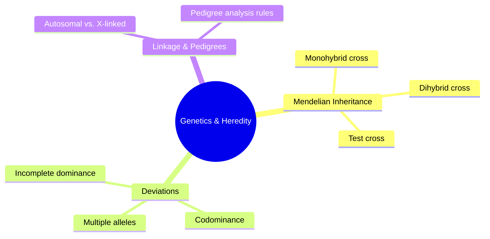

---
name: "biology-generator"
description: "Generate and upgrade biology study notes (NCERT/board/NEET level) in NoteBooks-Framework Markdown, across diversity & taxonomy, cell biology, genetics & heredity, molecular biology, evolution, human physiology, plant physiology, ecology & environment, and biotechnology. Self-contained: Markdown/callout/equation conventions, Mermaid diagrams, self-contained SVG and TikZ schematic figures (body plans, pedigrees, cladograms, population/enzyme-kinetics curves, ecological pyramids, cell-cycle diagrams), and interactive Desmos graphs are all built in -- no other skill needs loading alongside it. True biological illustration (anatomy, organelle/cell structure) isn't available yet and is placeholdered, not faked. Covers general-case-before-special-case derivation, classification/ratio consistency checks, and reconciling a textbook against supplementary notes. Use whenever the user asks to create, upgrade, extend, or gap-fill biology notes -- even without saying 'biology-generator'."
---
# Biology Notes Generator

A complete, standalone skill for producing NoteBooks-Framework Markdown biology notes -- covering diversity & taxonomy, cell biology, genetics, molecular biology, evolution, human and plant physiology, ecology, and biotechnology alike. Everything needed is in this one file: the renderer contract, writing and callout conventions, equation notation rules, Mermaid diagramming, self-contained SVG and TikZ schematic-figure patterns, and interactive Desmos graphing, plus biology-specific pedagogy and accuracy discipline. No other skill file needs to be read alongside this one.

## Renderer Contract

The NoteBooks renderer supports: ordinary Markdown (headings, paragraphs, emphasis, links, images, ordered/unordered lists, task lists where available), tables, blockquotes, fenced code blocks with syntax highlighting, footnotes, subscript/superscript, LaTeX math, and Obsidian-compatible conventions (including `[!type]` callouts).

**Mermaid** (fence tag exactly `mermaid`) and **TikZ via TikZJax** (fence tag exactly `tikz`) both render live in the current build. **SVG** (fence tag exactly `svg`) is being wired into the same fence whitelist as those two -- once it's live, verify with one throwaway `svg`-fenced block before relying on it for a whole chapter, the same discipline as any newly-added renderer. It carries less risk than the other three once confirmed: there's no parser or compiler step in between, the fence content becomes DOM content directly, so what's written is what renders. **Desmos** (fence tags `desmos` for 2D, `desmos3d` for 3D) is *not yet confirmed live* -- verify the same way before relying on it.

**True biological illustration is a separate, currently-disabled capability -- not an SVG/TikZ job.** Realistic anatomy, organelle/cell structure, organism morphology, microscopic structure, and similar illustrations require a fidelity neither tool can deliver and this renderer doesn't yet support any other way. Never fake one. Use an explicit placeholder instead:

```markdown
> **Biological illustration placeholder — add in a later pass**
>
> Planned figure: `[describe the organism/structure, the key labeled parts, and the point it's meant to make]`.
> Until real biological-illustration rendering is available, check first whether an SVG or TikZ schematic (body plan, pedigree, cladogram, pyramid, cycle diagram, curve -- see *SVG Diagrams* below) or a labeled table can carry the same point; use this placeholder only when neither can.
```

This is narrower than it sounds -- most of what a biology note actually needs (organism/organ body plans, crosses, pedigrees, phylogenies, growth/kinetics curves, ecological pyramids, cycle diagrams, gel schematics) is schematic or data-shaped, not a realistic illustration, and SVG (or TikZ) handles all of that live. See *SVG Diagrams* below for exactly where the line falls, and for **photographs specifically** (a plant/organism photo with no labeled structure to convey) -- don't attempt a sketch at all; either placeholder it or, often better, replace it with a short descriptive comparison in prose or a table, since a generic photo rarely carries information a sketch or a table couldn't convey more precisely.

**Working from an uploaded source diagram (e.g. an NCERT page):** look at it to understand the structure, parts, and labels it shows -- then compose an *original* SVG, TikZ, or Mermaid diagram that teaches the same thing in its own layout. Never extract, screenshot, trace, or otherwise embed the source image itself, regardless of the method used to get it out of a PDF or page -- that's reproducing the textbook's copyrighted illustration, not creating a schematic. Attribution doesn't change this: a "Source: NCERT" credit line answers where the original came from, not whether reproducing it is permitted -- it isn't, so credit the source under an originally-composed diagram, never in place of one. If the content genuinely needs realistic/artistic fidelity a schematic can't substitute for, that's the placeholder case above, not a reason to fall back to the source image.

Never use embedded scripts or arbitrary classes/CSS variables to simulate presentation in an SVG -- see *SVG Diagrams* below for why. Never present an unverified or unavailable diagram type as if it were a rendered figure.

## Writing, Layout, and Callout Conventions

- Start from the reader's question, not an unexplained formal definition. One primary idea per paragraph, short enough to scan.
- Headings form a meaningful, descriptive outline (`## Why heterozygote frequency peaks at p = 0.5`, not `## Explanation`) -- never skip levels arbitrarily.
- **Bold** for terms being defined, *italics* for emphasis, notation, *and every binomial species name* (`## Why *Escherichia coli* is a model organism`). Never bold whole paragraphs.
- Tables for comparisons, classifications, symbol glossaries, and formula summaries -- **including Punnett squares**, which are grids and belong in a Markdown table, not a diagram (see *SVG Diagrams* below). Numbered lists for procedures and derivations; bullets for unordered facts.
- Blockquotes with a bold label for portable callouts, and Obsidian `[!type]` callouts for anything that should stand out visually:

```markdown
> **Key idea:** Heterozygote frequency (2pq) is maximized when p = q = 0.5, not when one allele dominates.

> [!warning]
> Concluding a trait is autosomal recessive from a pedigree without checking *every* individual against that pattern is a common source of confidently wrong answers.

> [!example]
> ### 5.2 Solved — Dihybrid cross phenotype ratio (NCERT Example 5.1)
```

- Use callouts sparingly -- a note should not become a wall of colored boxes.
- Descriptive link text and image alt text; never "click here."
- Introduce an abbreviation once, then use it consistently.
- Preserve the source's meaning when improving prose -- never silently change facts, units, values, or conclusions.

## Equations and Notation

```markdown
Inline: \( p^2 + 2pq + q^2 = 1 \)

Display:

\[
v = \frac{V_{max}[S]}{K_m + [S]}
\]
```

Explain every symbol that isn't obvious, with units where relevant. Keep derivations stepwise, each a labeled display block, ending in `\boxed{...}`:

```markdown
\[
\begin{aligned}
q^2 &= \text{frequency of affected (aa) individuals} \\
    &= 0.0016 \\
q &= \sqrt{0.0016} = 0.04 \\
p &= 1 - q = \boxed{0.96}
\end{aligned}
\]
```

Box every named law, formula, or final numeric result with `\boxed{}` so it's visually distinct from intermediate working. Keep delimiters balanced; never place diagram syntax inside a math fence.

## Chapter Structure

Organize around the source's own logical order (definitions before mechanisms, mechanisms before applications), not reshuffled for narrative flair:

1. **Title + tagline** -- chapter name, **branch** (Diversity & Taxonomy / Cell Biology / Genetics & Heredity / Molecular Biology / Evolution / Human Physiology / Plant Physiology / Ecology & Environment / Biotechnology), and target level (Board / NEET), since depth expectations differ sharply.
2. **Concept Roadmap** -- one Mermaid flowchart mapping prerequisite → concept/mechanism → application, dark-themed to match the renderer's palette.
3. **Numbered sections matching the source's own structure** (Section 1, 2, 3…; subsections X.Y). Preserve this numbering when upgrading an existing note.
4. **Quick Reference**, split by kind: a **formula/ratio sheet** (Hardy-Weinberg, Mendelian ratios, growth equations) where the chapter is quantitative; a **classification/comparison table** (taxonomic ranks, homologous vs. analogous examples, hormone-and-effect tables) where it's more descriptive.
5. **Points to Ponder** -- the conceptual traps that actually cost marks: mislabeled classifications, pedigree conclusions that ignore one individual, dominant/recessive symbol mix-ups, confusing correlation in a pathway with causation.
6. **Problem-Solving Strategy** -- a short closing checklist per problem *type* (e.g. "Pedigree analysis: 1. is the trait present in every generation? 2. do affected individuals have affected parents? 3. does the ratio fit autosomal or X-linked?").

Tag each section with difficulty/importance stars (⭐ to ⭐⭐⭐).

## The Worked-Example Pattern

**Numerical** (genetics ratios, Hardy-Weinberg, population growth, enzyme kinetics, energy-pyramid calculations):

- **Given** -- the data restated cleanly, with units.
- **Find** -- what's actually being asked.
- **Concept** -- which principle/equation applies, and why (e.g. "two independently assorting genes ⟹ multiply individual-gene probabilities").
- **Work** -- the calculation, as stepped display-MathJax blocks.
- **Check** -- do the ratios/probabilities actually sum to 1 or to the expected total? Is the answer biologically possible (no negative population, no allele frequency outside \([0,1]\))?

**Structural/conceptual** (identification, classification, tracing a pedigree, explaining a mechanism):

- **Given** -- the specimen, observation, or pedigree.
- **Find** -- the classification, inheritance pattern, or mechanism asked for.
- **Concept** -- the rule set applied (dichotomous-key criteria, dominant/recessive pedigree rules, homology vs. analogy criteria).
- **Work** -- reasoning shown step by step (criterion by criterion, or generation by generation through a pedigree), not just an asserted conclusion.
- **Check** -- does the conclusion account for *every* individual/feature given, not just the convenient ones?

**Label every worked example by source**, so a student revising knows what's core syllabus vs. extra:

- `### 5.2 Solved — Dihybrid cross phenotype ratio (NCERT Example 5.1)` -- from the primary textbook, numbered to match it.
- `### 5.9 Additional Practice — X-linked pedigree analysis (New)` -- added during gap analysis.

## Derivation Convention: General Case Before Special Case

When a textbook states only a *special case* -- the classic 9:3:3:1 dihybrid ratio shown only as a memorized result rather than derived from the product rule across two independently assorting genes; Hardy-Weinberg shown only at one numeric allele frequency rather than as the general \(p^2+2pq+q^2=1\); the 10% energy-transfer rule asserted without the general trophic-efficiency reasoning behind it -- and a fuller derivation is available, **present the general result first**, then obtain the textbook's version by substituting the special condition into it. Don't present them as unrelated facts.

A student who only memorizes the special case is stuck the moment a problem changes the setup (three genes instead of two, an allele frequency the ratio wasn't "shown" for). Showing "here's the general principle, and here's how the familiar ratio falls out under this condition" builds the transferable skill. Every derivation is numbered steps, each a labeled display block, ending in `\boxed{}`.

## Biological Accuracy and Consistency Checks

Don't inherit a source's confidence uncritically:

- **Verify a classification before asserting it** -- don't call structures "homologous" vs. "analogous," a trait "dominant," an inheritance pattern "autosomal recessive," or a relationship "mutualistic" just because a source's label says so. Check against the actual defining criterion (common ancestry vs. convergent function; the pedigree pattern across *every* individual shown; both species genuinely benefiting).
- **Recompute genetic ratios rather than transcribing them** -- redo the Punnett square or the product-rule calculation from the given cross; confirm the phenotype ratio actually reduces to what's claimed.
- **Check a pedigree conclusion against every individual in it**, not just the convenient ones -- one unaffected child of two affected parents can rule out a proposed dominant pattern outright.
- **Verify Hardy-Weinberg and population-genetics numbers sum correctly** -- \(p+q=1\), genotype frequencies sum to 1, and the assumptions (random mating, no selection/migration/drift/mutation) are at least noted before invoking the equilibrium.
- **Sanity-check ecological and physiological numbers** -- energy transfer between trophic levels is a rule of thumb (~10%), not an exact law; state it as such rather than treating it as universally precise.

> [!warning] ⚠️ A real trap to avoid
> A pedigree where two unaffected parents have an affected child rules out a dominant pattern outright -- the trait must be recessive. Asserting "dominant" from a pedigree without checking every individual against the proposed pattern is a common source of confidently wrong answers.

## Notation and Terminology Discipline

Every time a new term is introduced:

- Give the **binomial name in italics**, genus capitalized, species lowercase (*Homo sapiens*), alongside the common name.
- State the **gene symbol convention in force** -- dominant allele capitalized, recessive lowercase (or the textbook's own convention, if different), and use it consistently for the rest of the note.
- State **units** for any quantitative biology (population size, reaction rate, concentration).
- Prefer the term's **standard scientific usage** over a colloquial synonym, giving the colloquial term alongside where a source uses one.
- Box every named law, formula, or final numeric result.

## Mermaid Diagrams

Use the fence tag exactly `mermaid`. Give every node a readable label, keep node text short and put detail in surrounding prose, use arrows whose direction expresses the actual relationship, use a decision node only where the process truly branches, and keep diagrams small enough to understand without zooming. Always follow a diagram with a sentence of interpretation. Treat labels and links as content, not executable code -- no arbitrary HTML, JavaScript, or unsafe URL payloads. Skip Mermaid where a table or short list is clearer.

Mermaid is for **classification, decision logic, and pathways** -- never for anything needing real geometric or data accuracy (a body plan, a growth curve, a pedigree, a pyramid -- those are SVG or TikZ, below). Use it for:

- **Concept roadmaps** (prerequisite → concept/mechanism → application), one per chapter.
- **Classification trees** -- the five kingdoms, plant/animal phyla, a specific dichotomous key rendered as a decision flowchart ("does it have a backbone? → yes/no → …").
- **"Which principle applies?" decision flowcharts** -- autosomal vs. X-linked from pedigree clues, mitosis vs. meiosis from the described cell behaviour, which macromolecule class fits a described structure.
- **Pathway / process flows** -- the steps of glycolysis or the Krebs cycle *as a labeled sequence* (not the molecular structures themselves, which are a placeholder per the Renderer Contract), the central dogma (DNA → RNA → protein), a hormonal feedback loop.
- **Hierarchical topic breakdowns for revision** -- a chapter's topics fanning out into sub-topics, with no directional "leads to" meaning between siblings. Use Mermaid's `mindmap` type, not `flowchart`:



Use `flowchart` when arrows carry meaning; use `mindmap` when the structure is "these are the parts of this topic" with no ordering between them.

## SVG Diagrams

Use the fence tag exactly `svg` for organism/organ body plans, pedigrees, cladograms, growth/kinetics curves, ecological pyramids, cell-cycle diagrams, base-pairing ladders, and gel schematics -- **this is the default choice** for biology's schematic figures once confirmed live (see Renderer Contract), ahead of TikZ, because there's no parser or macro layer between what's written and what renders: no PGF quirks to route around, no compile step that can silently drop a figure.

> [!warning] ⚠️ Every SVG block must be fully self-contained
> Write literal values only -- hex colors (`#2e7d32`), explicit `stroke-width`, `font-size`, `font-family` -- never a CSS class or a `var(--custom-property)`. The note's page won't have any stylesheet rules defined for a class or variable invented on the spot, so anything that depends on one will render as an unstyled or invisible mess even though the markup itself is perfectly valid. This is the single most likely mistake when adapting an SVG sketched in a different tool for preview -- strip every `class=` and `var(...)` before it goes in a note. The literal colors below assume a light page background; adjust them, or add an explicit background rect, if the actual page background isn't confirmed light.

**1. Organism/organ body plan** (labeled external structure -- holdfast/stipe/frond, thallus parts, root/stem/leaf, etc.; adapt the branching shape and labels to the actual organism):

```svg
<svg viewBox="0 0 480 400" xmlns="http://www.w3.org/2000/svg" style="max-width:100%;height:auto" font-family="sans-serif">
  <ellipse cx="140" cy="350" rx="16" ry="8" fill="#2e7d32" fill-opacity="0.25" stroke="#2e7d32" stroke-width="1.2"/>
  <line x1="140" y1="342" x2="140" y2="260" stroke="#262626" stroke-width="3"/>
  <polyline points="140,260 115,210 100,160" fill="none" stroke="#262626" stroke-width="2"/>
  <polyline points="140,260 165,210 180,160" fill="none" stroke="#262626" stroke-width="2"/>
  <circle cx="115" cy="210" r="5" fill="#e65100"/>
  <circle cx="165" cy="210" r="5" fill="#e65100"/>
  <circle cx="180" cy="160" r="2" fill="#262626"/>
  <line x1="180" y1="160" x2="380" y2="160" stroke="#9e9e9e" stroke-width="1" stroke-dasharray="3,3"/>
  <text x="386" y="164" font-size="13" fill="#262626">Frond</text>
  <circle cx="165" cy="210" r="2" fill="#262626"/>
  <line x1="165" y1="210" x2="380" y2="210" stroke="#9e9e9e" stroke-width="1" stroke-dasharray="3,3"/>
  <text x="386" y="214" font-size="13" fill="#262626">Air bladder</text>
  <line x1="150" y1="350" x2="380" y2="350" stroke="#9e9e9e" stroke-width="1" stroke-dasharray="3,3"/>
  <text x="386" y="354" font-size="13" fill="#262626">Holdfast</text>
</svg>
```

**2. Segmented stem with node whorls** (e.g. *Equisetum*):

```svg
<svg viewBox="0 0 480 480" xmlns="http://www.w3.org/2000/svg" style="max-width:100%;height:auto" font-family="sans-serif">
  <line x1="180" y1="420" x2="300" y2="420" stroke="#262626" stroke-width="2"/>
  <line x1="200" y1="420" x2="200" y2="440" stroke="#262626" stroke-width="1"/>
  <line x1="240" y1="420" x2="240" y2="440" stroke="#262626" stroke-width="1"/>
  <line x1="280" y1="420" x2="280" y2="440" stroke="#262626" stroke-width="1"/>
  <line x1="240" y1="420" x2="240" y2="120" stroke="#262626" stroke-width="2.5"/>
  <ellipse cx="240" cy="95" rx="14" ry="26" fill="#2e7d32" fill-opacity="0.3" stroke="#2e7d32" stroke-width="1"/>
  <line x1="240" y1="340" x2="205" y2="305" stroke="#262626" stroke-width="1"/>
  <line x1="240" y1="340" x2="270" y2="305" stroke="#262626" stroke-width="1"/>
  <circle cx="240" cy="340" r="3" fill="#262626"/>
  <line x1="240" y1="260" x2="205" y2="225" stroke="#262626" stroke-width="1"/>
  <line x1="240" y1="260" x2="270" y2="225" stroke="#262626" stroke-width="1"/>
  <circle cx="240" cy="260" r="3" fill="#262626"/>
  <line x1="240" y1="180" x2="205" y2="150" stroke="#262626" stroke-width="1"/>
  <line x1="240" y1="180" x2="270" y2="150" stroke="#262626" stroke-width="1"/>
  <circle cx="240" cy="180" r="3" fill="#262626"/>
  <line x1="254" y1="95" x2="380" y2="95" stroke="#9e9e9e" stroke-width="1" stroke-dasharray="3,3"/>
  <text x="386" y="99" font-size="13" fill="#262626">Strobilus</text>
  <line x1="270" y1="150" x2="380" y2="150" stroke="#9e9e9e" stroke-width="1" stroke-dasharray="3,3"/>
  <text x="386" y="154" font-size="13" fill="#262626">Branch</text>
  <line x1="240" y1="220" x2="380" y2="220" stroke="#9e9e9e" stroke-width="1" stroke-dasharray="3,3"/>
  <text x="386" y="224" font-size="13" fill="#262626">Internode</text>
  <line x1="240" y1="260" x2="380" y2="260" stroke="#9e9e9e" stroke-width="1" stroke-dasharray="3,3"/>
  <text x="386" y="264" font-size="13" fill="#262626">Node</text>
  <line x1="280" y1="425" x2="380" y2="425" stroke="#9e9e9e" stroke-width="1" stroke-dasharray="3,3"/>
  <text x="386" y="429" font-size="13" fill="#262626">Rhizome</text>
</svg>
```

**3. Pedigree chart** (squares = male, circles = female, filled = affected):

```svg
<svg viewBox="0 0 420 210" xmlns="http://www.w3.org/2000/svg" style="max-width:100%;height:auto" font-family="sans-serif">
  <rect x="40" y="30" width="34" height="34" fill="#ffffff" stroke="#262626" stroke-width="1.5"/>
  <text x="57" y="82" font-size="12" fill="#262626" text-anchor="middle">I-1</text>
  <circle cx="140" cy="47" r="17" fill="#262626" stroke="#262626" stroke-width="1.5"/>
  <text x="140" y="82" font-size="12" fill="#262626" text-anchor="middle">I-2</text>
  <line x1="74" y1="47" x2="123" y2="47" stroke="#262626" stroke-width="1.5"/>
  <line x1="98" y1="47" x2="98" y2="120" stroke="#262626" stroke-width="1.5"/>
  <line x1="30" y1="120" x2="200" y2="120" stroke="#262626" stroke-width="1.5"/>
  <rect x="13" y="150" width="34" height="34" fill="#ffffff" stroke="#262626" stroke-width="1.5"/>
  <text x="30" y="200" font-size="12" fill="#262626" text-anchor="middle">II-1</text>
  <circle cx="115" cy="167" r="17" fill="#ffffff" stroke="#262626" stroke-width="1.5"/>
  <text x="115" y="200" font-size="12" fill="#262626" text-anchor="middle">II-2</text>
  <rect x="183" y="150" width="34" height="34" fill="#262626" stroke="#262626" stroke-width="1.5"/>
  <text x="200" y="200" font-size="12" fill="#262626" text-anchor="middle">II-3</text>
  <line x1="30" y1="120" x2="30" y2="150" stroke="#262626" stroke-width="1.5"/>
  <line x1="200" y1="120" x2="200" y2="150" stroke="#262626" stroke-width="1.5"/>
  <text x="270" y="167" font-size="12" fill="#262626">filled = affected;</text>
  <text x="270" y="185" font-size="12" fill="#262626">check every individual</text>
</svg>
```

**4. Phylogenetic tree / cladogram** -- hand-place node coordinates; for a tree with many taxa, TikZ's automatic `child{}` layout (below) is genuinely less tedious than computing every branch point by hand:

```svg
<svg viewBox="0 0 420 200" xmlns="http://www.w3.org/2000/svg" style="max-width:100%;height:auto" font-family="sans-serif">
  <text x="150" y="15" font-size="13" fill="#262626">Common ancestor</text>
  <line x1="200" y1="22" x2="200" y2="50" stroke="#262626" stroke-width="1.5"/>
  <line x1="100" y1="50" x2="300" y2="50" stroke="#262626" stroke-width="1.5"/>
  <line x1="100" y1="50" x2="60" y2="90" stroke="#262626" stroke-width="1.5"/>
  <line x1="100" y1="50" x2="140" y2="90" stroke="#262626" stroke-width="1.5"/>
  <line x1="300" y1="50" x2="260" y2="90" stroke="#262626" stroke-width="1.5"/>
  <line x1="300" y1="50" x2="340" y2="90" stroke="#262626" stroke-width="1.5"/>
  <text x="30" y="108" font-size="11" fill="#262626">Species 1</text>
  <text x="110" y="108" font-size="11" fill="#262626">Species 2</text>
  <text x="230" y="108" font-size="11" fill="#262626">Species 3</text>
  <text x="310" y="108" font-size="11" fill="#262626">Species 4</text>
</svg>
```

**5. Population growth curve** (exponential vs. logistic):

```svg
<svg viewBox="0 0 440 300" xmlns="http://www.w3.org/2000/svg" style="max-width:100%;height:auto" font-family="sans-serif">
  <line x1="40" y1="260" x2="420" y2="260" stroke="#262626" stroke-width="1.5"/>
  <text x="380" y="278" font-size="12" fill="#262626">time</text>
  <line x1="40" y1="260" x2="40" y2="20" stroke="#262626" stroke-width="1.5"/>
  <text x="10" y="18" font-size="12" fill="#262626">population</text>
  <line x1="40" y1="60" x2="410" y2="60" stroke="#9e9e9e" stroke-width="1" stroke-dasharray="4,3"/>
  <text x="414" y="64" font-size="12" fill="#9e9e9e">K</text>
  <polyline points="45,235 90,225 140,205 180,170 220,130 270,90 320,68 370,61 410,60" fill="none" stroke="#1565c0" stroke-width="2.2"/>
  <polyline points="45,235 110,215 170,175 220,120 260,60" fill="none" stroke="#c62828" stroke-width="2.2" stroke-dasharray="5,3"/>
  <text x="325" y="88" font-size="12" fill="#1565c0">logistic</text>
  <text x="220" y="52" font-size="12" fill="#c62828">exponential</text>
</svg>
```

**6. Ecological pyramid** (energy/biomass/numbers):

```svg
<svg viewBox="0 0 380 300" xmlns="http://www.w3.org/2000/svg" style="max-width:100%;height:auto" font-family="sans-serif">
  <polygon points="70,260 310,260 260,200 120,200" fill="#a5d6a7" stroke="#2e7d32" stroke-width="1"/>
  <text x="190" y="235" font-size="12" fill="#1b3a1e" text-anchor="middle">Producers</text>
  <polygon points="120,200 260,200 230,145 150,145" fill="#81c784" stroke="#2e7d32" stroke-width="1"/>
  <text x="190" y="177" font-size="11" fill="#1b3a1e" text-anchor="middle">Primary consumers</text>
  <polygon points="150,145 230,145 210,95 170,95" fill="#66bb6a" stroke="#2e7d32" stroke-width="1"/>
  <text x="190" y="125" font-size="10" fill="#0d2b10" text-anchor="middle">Secondary consumers</text>
  <polygon points="170,95 210,95 198,55 182,55" fill="#4caf50" stroke="#2e7d32" stroke-width="1"/>
  <text x="190" y="80" font-size="9" fill="#ffffff" text-anchor="middle">Tertiary</text>
  <text x="190" y="285" font-size="11" fill="#555555" text-anchor="middle">each level ~10% of the energy of the one below</text>
</svg>
```

**7. Cell-cycle phase diagram:**

```svg
<svg viewBox="0 0 320 320" xmlns="http://www.w3.org/2000/svg" style="max-width:100%;height:auto" font-family="sans-serif">
  <circle cx="160" cy="150" r="110" fill="none" stroke="#1565c0" stroke-width="2.2"/>
  <line x1="160" y1="150" x2="160" y2="40" stroke="#9e9e9e" stroke-width="1"/>
  <line x1="160" y1="150" x2="238" y2="72" stroke="#9e9e9e" stroke-width="1"/>
  <line x1="160" y1="150" x2="270" y2="150" stroke="#9e9e9e" stroke-width="1"/>
  <line x1="160" y1="150" x2="160" y2="260" stroke="#9e9e9e" stroke-width="1"/>
  <text x="180" y="80" font-size="13" fill="#262626">G1</text>
  <text x="215" y="115" font-size="13" fill="#262626">S</text>
  <text x="210" y="200" font-size="13" fill="#262626">G2</text>
  <text x="95" y="180" font-size="13" fill="#262626">M</text>
  <text x="160" y="300" font-size="11" fill="#555555" text-anchor="middle">interphase (G1, S, G2) occupies most of the cycle; M is brief</text>
</svg>
```

**8. Enzyme activity vs. temperature/pH curve:**

```svg
<svg viewBox="0 0 440 300" xmlns="http://www.w3.org/2000/svg" style="max-width:100%;height:auto" font-family="sans-serif">
  <line x1="40" y1="260" x2="420" y2="260" stroke="#262626" stroke-width="1.5"/>
  <text x="360" y="278" font-size="12" fill="#262626">temperature</text>
  <line x1="40" y1="260" x2="40" y2="20" stroke="#262626" stroke-width="1.5"/>
  <text x="8" y="18" font-size="12" fill="#262626">rate</text>
  <polyline points="45,240 100,205 150,150 200,80 230,55 260,80 310,180 360,235 405,255" fill="none" stroke="#1565c0" stroke-width="2.2"/>
  <line x1="230" y1="260" x2="230" y2="55" stroke="#9e9e9e" stroke-width="1" stroke-dasharray="4,3"/>
  <text x="205" y="278" font-size="11" fill="#262626">optimum</text>
</svg>
```

**9. DNA base-pairing schematic** (a flattened ladder, not a rendered double helix -- deliberately, per the Renderer Contract):

```svg
<svg viewBox="0 0 260 340" xmlns="http://www.w3.org/2000/svg" style="max-width:100%;height:auto" font-family="sans-serif">
  <line x1="60" y1="20" x2="60" y2="300" stroke="#1565c0" stroke-width="2.5"/>
  <line x1="200" y1="20" x2="200" y2="300" stroke="#e65100" stroke-width="2.5"/>
  <line x1="60" y1="50" x2="200" y2="50" stroke="#262626" stroke-width="1.5"/>
  <text x="130" y="45" font-size="12" fill="#262626" text-anchor="middle">A—T</text>
  <line x1="60" y1="110" x2="200" y2="110" stroke="#262626" stroke-width="1.5"/>
  <text x="130" y="105" font-size="12" fill="#262626" text-anchor="middle">G—C</text>
  <line x1="60" y1="170" x2="200" y2="170" stroke="#262626" stroke-width="1.5"/>
  <text x="130" y="165" font-size="12" fill="#262626" text-anchor="middle">T—A</text>
  <line x1="60" y1="230" x2="200" y2="230" stroke="#262626" stroke-width="1.5"/>
  <text x="130" y="225" font-size="12" fill="#262626" text-anchor="middle">C—G</text>
  <text x="45" y="15" font-size="12" fill="#1565c0">5'</text>
  <text x="195" y="15" font-size="12" fill="#e65100">3'</text>
  <text x="130" y="325" font-size="11" fill="#555555" text-anchor="middle">A pairs with T, G with C -- strand polarity runs antiparallel</text>
</svg>
```

**10. Gel electrophoresis band schematic:**

```svg
<svg viewBox="0 0 380 300" xmlns="http://www.w3.org/2000/svg" style="max-width:100%;height:auto" font-family="sans-serif">
  <rect x="20" y="20" width="340" height="240" fill="#f5f5f5" stroke="#262626" stroke-width="1.5"/>
  <rect x="50" y="24" width="40" height="12" fill="#757575"/>
  <text x="70" y="16" font-size="11" fill="#262626" text-anchor="middle">well 1</text>
  <rect x="55" y="90" width="30" height="10" fill="#757575"/>
  <rect x="55" y="160" width="30" height="10" fill="#757575"/>
  <rect x="160" y="24" width="40" height="12" fill="#757575"/>
  <text x="180" y="16" font-size="11" fill="#262626" text-anchor="middle">well 2</text>
  <rect x="165" y="120" width="30" height="10" fill="#757575"/>
  <text x="190" y="284" font-size="12" fill="#555555" text-anchor="middle">smaller fragments migrate farther</text>
</svg>
```

**General rules:** every band/branch/curve/region gets a label -- never color alone. One diagram per genuinely load-bearing idea; skip it if a table or sentence says it just as clearly (Punnett squares especially). Always follow a figure with a sentence of interpretation. Add `style="max-width:100%;height:auto"` on the root `<svg>` so it scales with the note's content column instead of overflowing it. If the point is exploring how a curve responds to a changing parameter, that belongs in Desmos (below); if it's a realistic illustration, that's the Renderer Contract placeholder.

## TikZ Diagrams

TikZJax still renders live and remains a fully legitimate alternative to SVG -- its main advantage is automatic node placement for branching trees via `child{}`, which is genuinely less tedious than hand-computing every branch coordinate for a pedigree or cladogram with more than a handful of individuals/taxa. For everything else (curves, pyramids, cycle diagrams, body plans), SVG's lack of a parse step makes it the simpler default (see *SVG Diagrams* above).

Use the fence tag exactly `tikz`. `\usetikzlibrary{arrows.meta}` is available for arrowhead styling.

> [!warning] ⚠️ Renderer quirks that will silently break a figure
> `style=italic` is **not a valid TikZ key** -- use `font=\itshape\small` instead. Prefer `plot coordinates {...}` over parametric `plot({...},{...})` expressions. Any `<->` line needs **both** `>={Stealth[...]}` and `<={Stealth[...]}` set in the `tikzpicture` options, or one arrowhead silently won't render. Avoid `\foreach` -- write out repeated elements explicitly instead.

**Phylogenetic tree / cladogram**, the case where TikZ's automatic layout earns its keep -- build with `child{}` (not `\foreach`), one `child` per branch, and TikZ computes the spacing:

```tikz
\begin{tikzpicture}[thick, scale=1.0, level distance=1.6cm,
  level 1/.style={sibling distance=3cm}, level 2/.style={sibling distance=1.6cm}]
  \node {Common ancestor}
    child { node {Clade A}
      child { node {Species 1} }
      child { node {Species 2} } }
    child { node {Clade B}
      child { node {Species 3} }
      child { node {Species 4} } };
\end{tikzpicture}
```

Every other pattern this skill needs (body plans, pedigrees, growth/kinetics curves, pyramids, cell-cycle diagrams, base-pairing ladders, gel schematics) has a working template in *SVG Diagrams* above -- reach for the TikZ equivalent only by translating the same geometry into `\draw`/`\node`/`plot coordinates`, following the quirks above, when SVG isn't available or a large tree makes `child{}`'s automatic layout worth it.

## Desmos Interactive Graphs

Confirm Desmos actually renders here (see Renderer Contract) before relying on it. Where confirmed, it earns its place over a static curve specifically when **interactivity adds understanding** -- dragging a slider and watching a curve respond. `desmos3d` is rarely needed in biology (most relationships here are two-variable); reach for it only if a genuinely three-dimensional relationship comes up (e.g. a fitness landscape as a function of two traits). Skip Desmos entirely when a static figure already does the job. **One relationship per block.**

**Fence tags are exact and non-negotiable:** 2D state → ` ```desmos `, 3D state → ` ```desmos3d ` (one word, no hyphen -- `desmos-3d` will not be picked up). Get this wrong and the block fails silently or renders as plain code.

**Block format:** each line is one Desmos expression, in any dependency order. A bare `name=value` line whose value doesn't depend on anything else in the block automatically becomes a draggable slider -- no special syntax needed.

> [!warning] ⚠️ Never assign to `\theta`
> `\theta` is a reserved polar-coordinate keyword in Desmos. Writing `\theta=...` looks completely valid but silently breaks. Use a different symbol (`r`, `k`, `\phi`) for anything angle-like.

**Pattern 1 -- Logistic population growth, exploring growth rate and carrying capacity:**

```desmos
r=0.3
K=1000
N_{0}=50
N\left(t\right)=\frac{K}{1+\left(\frac{K-N_{0}}{N_{0}}\right)e^{-rt}}
```

*Legend:* `r` = intrinsic growth rate (slider), `K` = carrying capacity (slider), `N_0` = initial population, `N(t)` = population over time.
*Try this:* drag `r` to change how fast the curve approaches `K`; drag `K` to change the ceiling it levels off at.

**Pattern 2 -- Michaelis-Menten enzyme kinetics, exploring $V_{max}$ and $K_m$:**

```desmos
V_{max}=10
K_{m}=2
v\left(S\right)=\frac{V_{max}\cdot S}{K_{m}+S}
```

*Legend:* `V_max` = maximum reaction rate (slider), `K_m` = substrate concentration at half-`V_max` (slider), `v(S)` = reaction rate vs. substrate concentration.
*Try this:* drag `K_m` down and watch the curve reach half-`V_max` at a lower substrate concentration -- a smaller `K_m` means higher apparent affinity.

**Pattern 3 -- Hardy-Weinberg genotype frequencies vs. allele frequency:**

```desmos
p=0.6
q=1-p
f_{AA}=p^{2}
f_{Aa}=2p q
f_{aa}=q^{2}
```

*Legend:* `p` = frequency of the dominant allele (slider), `q = 1-p`, `f_AA/f_Aa/f_aa` = genotype frequencies.
*Try this:* drag `p` and watch heterozygote frequency (`f_Aa`) peak at `p = 0.5`, while both homozygote frequencies fall as `p` moves toward either extreme.

**Verification -- what you can and can't check.** There is no local Desmos evaluator available. Verify the underlying biology/maths independently before encoding it, do a static syntax review against the rules above (exact fence tag, no `\theta` assignment, balanced `\left(`/`\right)`, one expression per line), and cross-check any new construct against a known-working one already used elsewhere in the note. State plainly, when handing off a note with new Desmos blocks, that the syntax was reviewed but not executed.

## Working from a Primary Source + Supplementary Notes

Biology notes are usually built from a textbook (NCERT, a syllabus PDF) plus a student's own coaching/handwritten notes.

- **Preserve the source's own section numbering** when upgrading an existing note, and keep proposed changes distinguishable from settled note text.
- **Recompute, don't transcribe, every ratio or numeric answer** -- redo the Punnett square, the Hardy-Weinberg calculation, or the population-growth figure from the given data.
- **Finish incomplete derivations** -- a source that sets up a cross, an equilibrium equation, or a pathway and stops is a gap to fill, not a stopping point to reproduce.
- **A textbook's own worked example can itself be incomplete** -- a two-part question whose printed solution only answers one part, or a pedigree analysis that doesn't check every individual. Complete it, and note that you did.
- **Prefer the more general derivation when both a special-case and general-case source exist** (see *Derivation Convention* above).
- **Reconcile terminology between sources rather than silently picking one** -- handwritten/coaching notes often use older or regional common names; give the standard scientific term as primary and the common name alongside.
- **Never invent a citation, source, or number** that wasn't actually given or derivable from what was given.

## Branch Quick Guide

| Branch                | Typical diagram                                                                                                            | Notation/discipline to watch                                                  |
| --------------------- | -------------------------------------------------------------------------------------------------------------------------- | ----------------------------------------------------------------------------- |
| Diversity & taxonomy  | Mermaid classification tree / dichotomous-key decision flowchart; SVG body plan for a specimen's external structure        | binomial nomenclature (italic), correct taxonomic rank order                  |
| Cell biology          | SVG cell-cycle phase diagram; realistic organelle structure is a placeholder                                               | interphase vs. mitosis proportion of the cycle                                |
| Genetics & heredity   | Markdown table for Punnett squares; SVG (or TikZ) pedigree chart; Desmos for Hardy-Weinberg exploration                    | dominant/recessive symbol convention, genotype vs. phenotype                  |
| Molecular biology     | SVG base-pairing schematic (flattened ladder); Mermaid pathway flowchart for the central dogma                             | true molecular 3D structure is a placeholder                                  |
| Evolution             | SVG (or TikZ, if the tree is large) phylogenetic tree/cladogram; Desmos for allele-frequency exploration                   | homologous vs. analogous checked against actual criteria, not pattern-matched |
| Human physiology      | Mermaid feedback-loop flowchart; realistic anatomy is a placeholder                                                        | hormone/effect tables kept accurate to source, not memory                     |
| Plant physiology      | SVG photosynthesis-rate curve; Desmos for light-intensity/CO2 saturation exploration; SVG body plan for external structure | leaf/tissue cross-section illustration is a placeholder                       |
| Ecology & environment | SVG ecological pyramid, population growth curve; Desmos for exploring$r$/$K$                                           | ~10% energy-transfer rule stated as a rule of thumb, not an exact law         |
| Biotechnology         | SVG gel electrophoresis schematic; Mermaid process flowchart (PCR, recombinant DNA steps)                                  | restriction-site notation, vector/insert terminology                          |

Revision-stage topic breakdowns, across any branch, use Mermaid `mindmap` (see *Mermaid Diagrams*) rather than a branch-specific diagram tool.

## Final Quality Checklist

- The title states the actual chapter, branch, and level.
- Every section carries a difficulty tag, and the roadmap reflects the note's actual structure (update it last, after content changes).
- Every binomial species name is italicized; every gene-symbol convention is stated once and used consistently.
- Every named law, formula, or final numeric result is boxed.
- Worked examples are labeled by source (`NCERT X.Y` vs. `(New)`).
- Any generalized derivation shows the textbook's special case falling out of it, not sitting beside it unexplained.
- No classification (homologous/analogous, dominant/recessive pattern, taxonomic rank, ecological relationship) is asserted without checking it against the actual data or criteria given.
- Every pedigree conclusion is checked against *every* individual shown, not just the convenient ones.
- Genetic ratios and Hardy-Weinberg frequencies are recomputed, not transcribed, and actually sum correctly.
- No realistic biological illustration is faked, and no photograph is sketched -- it's a placeholder, a table/prose comparison, or an original SVG/TikZ schematic wherever one could substitute.
- Every SVG block is self-contained: literal hex colors and explicit attributes only, never a `class=` or `var(...)` that depends on a stylesheet the note doesn't have.
- Mermaid fences are valid, small, and each is followed by a sentence of interpretation; `mindmap` is used only for non-sequential topic breakdowns.
- Any TikZ figure used instead of SVG follows `font=\itshape\small` for italic captions, `plot coordinates` over parametric plotting, both arrow-tip styles for any `<->` line, and avoids `\foreach`; Punnett squares are Markdown tables either way.
- Any Desmos block: exact fence tag, no `\theta` assignment, a legend before it and a "try this" line after it, and the note is honest that syntax was reviewed, not executed.
- Facts, quotations, and source attributions were not invented or silently altered.
- The note remains useful in raw Markdown view, not just rendered view.
