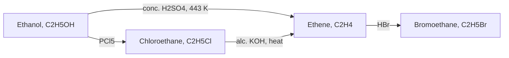
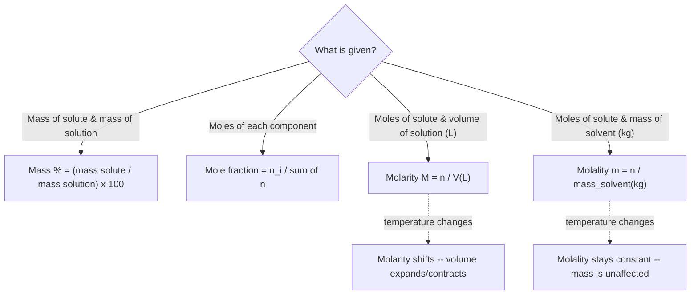

# Chemistry Notes Generator

A complete, standalone skill for producing NoteBooks-Framework Markdown chemistry notes -- covering physical, inorganic, organic, and analytical chemistry alike. Everything needed is in this one file: the renderer contract, writing and callout conventions, math notation rules, Mermaid diagramming, TikZ figure patterns, and interactive Desmos graphing, plus chemistry-specific pedagogy and accuracy discipline. No other skill file needs to be read alongside this one.

## Renderer Contract

The NoteBooks renderer supports: ordinary Markdown (headings, paragraphs, emphasis, links, images, ordered/unordered lists, task lists where available), tables, blockquotes, fenced code blocks with syntax highlighting, footnotes, subscript/superscript, LaTeX math, Obsidian-compatible conventions (including `[!type]` callouts), and source-aware "suggest changes" workflows.

**Mermaid** (fence tag exactly `mermaid`) and **TikZ via TikZJax** (fence tag exactly `tikz`) both render live in the current build. **Desmos** (fence tags `desmos` for 2D, `desmos3d` for 3D) is *not yet confirmed live* on the current build -- before relying on it anywhere beyond a single test figure, render one throwaway `desmos`-fenced block and confirm it actually appears. If it doesn't, fall back to the Generic Curve TikZ template (TikZ pattern 2 below). A `smiles` fence for true skeletal/SMILES organic structures was also under active development as of the last check -- verify the same way before relying on it for an organic chapter, falling back to the plain atom-and-bond TikZ style (patterns 3-4 below) if unavailable.

Never use raw HTML, inline CSS, embedded scripts, or arbitrary classes to simulate presentation. Never present an unverified or unavailable diagram type as if it were a rendered figure -- state plainly what wasn't confirmed.

## Writing, Layout, and Callout Conventions

- Start from the reader's question, not an unexplained formal definition. One primary idea per paragraph, short enough to scan.
- Headings form a meaningful, descriptive outline (`## How buffers resist pH change`, not `## Explanation`) -- never skip levels arbitrarily.
- **Bold** for terms being defined, *italics* for emphasis or notation. Never bold whole paragraphs.
- Tables for comparisons, classifications, symbol glossaries, and formula/reaction summaries. Numbered lists for procedures, derivations, and balancing steps; bullets for unordered facts.
- Blockquotes with a bold label for portable callouts, and Obsidian `[!type]` callouts for anything that should stand out visually:

```markdown
> **Key idea:** A catalyst changes the rate of a reaction without shifting the equilibrium position.

> [!warning]
> Presenting the small-x approximation as always valid is a common source of confidently wrong answers.

> [!example]
> ### 3.4 Solved — Empirical formula from % composition (NCERT Example 1.2)
```

- Use callouts sparingly -- a note should not become a wall of colored boxes.
- Descriptive link text and image alt text; never "click here."
- Introduce an abbreviation once, then use it consistently.
- Preserve the source's meaning when improving prose -- never silently change facts, units, dates, quotations, or conclusions.

## Equations and Notation

```markdown
Inline: \( \Delta G = \Delta H - T\Delta S \)

Display:

\[
K_c = \frac{[\text{products}]}{[\text{reactants}]}
\]
```

Explain every symbol that isn't obvious, with units and sign conventions. Keep derivations stepwise, each a labeled display block, ending in `\boxed{...}`:

```markdown
\[
\begin{aligned}
\Delta n_g &= (\text{mol gas products}) - (\text{mol gas reactants}) \\
\Delta H &= \Delta U + \Delta n_g RT \\
\boxed{\Delta H = \Delta U + \Delta n_g RT}
\end{aligned}
\]
```

Box every named law, definition, or final numeric result with `\boxed{}` so it's visually distinct from intermediate working. Keep delimiters balanced; never place diagram syntax inside a math fence.

## Chapter Structure

Organize around the source's own logical order (definitions before laws, laws before applications), not reshuffled for narrative flair:

1. **Title + tagline** -- chapter name, **branch** (Physical / Inorganic / Organic / Analytical), and target level (Board / NEET / JEE), since depth expectations differ sharply.
2. **Concept Roadmap** -- one Mermaid flowchart mapping prerequisite → concept/law → application, dark-themed to match the renderer's palette.
3. **Numbered sections matching the source's own structure** (Section 1, 2, 3…; subsections X.Y). Preserve this numbering when upgrading an existing note.
4. **Quick Reference**, split by kind:
   - a **formula sheet** (quantitative relationships), grouped by topic;
   - a **reaction/equation sheet** (named reactions, general equations) where the chapter has them;
   - a **facts-and-trends table** (periodic trends, exceptions, named laws with discoverer/year) where the chapter is more descriptive than quantitative.
5. **Points to Ponder** -- the conceptual traps that actually cost marks: sign/convention errors, mislabeled classifications, small-x approximations used without checking, octet-rule exceptions, anomalous first-group-member behaviour.
6. **Problem-Solving Strategy** -- a short closing checklist per problem *type* (e.g. "Empirical formula: 1. convert % to mass, assume 100 g … "; "Redox balancing: 1. assign oxidation states … "; "Predicting geometry: 1. count electron domains, including lone pairs …").

Tag each section with difficulty/importance stars (⭐ to ⭐⭐⭐).

## The Worked-Example Pattern

**Numerical** (stoichiometry, thermodynamics, equilibrium, kinetics, electrochemistry):
- **Given** -- data restated cleanly, with state symbols and units.
- **Find** -- what's actually being asked.
- **Concept** -- which law/equation applies, and why (e.g. "limiting reagent ⟹ compute moles of product from *each* reactant, take the smaller").
- **Work** -- the calculation, as stepped display-MathJax blocks.
- **Check** -- units and sig figs correct? equation balanced before its coefficients were used? any "x is small" approximation actually valid in hindsight? does the number make physical sense (pH in 0-14, rate constant positive, mole fraction in 0-1)?

**Structural/conceptual** (bonding, geometry, mechanism, prediction, qualitative identification):
- **Given** -- the species, reagents, or observation.
- **Find** -- the structure, geometry, product, or identification asked for.
- **Concept** -- the rule set applied (VSEPR domain count, formal-charge comparison of resonance structures, mechanism type, characteristic test/reagent).
- **Work** -- reasoning shown step by step (electron count → domain count → geometry; or arrow-pushing step by step), not just an asserted final structure.
- **Check** -- octet/formal-charge consistency, charge/electron conservation across a mechanism, agreement with the actual data given.

**Label every worked example by source**, so a student revising knows what's core syllabus vs. extra:
- `### 3.4 Solved — Empirical formula from % composition (NCERT Example 1.2)` -- from the primary textbook, numbered to match it.
- `### 3.9 Additional Practice — Balancing a redox equation by ion-electron method (New)` -- added during gap analysis.

## Derivation Convention: General Case Before Special Case

When a textbook states only a *special case* -- the ideal gas equation shown only through Boyle's/Charles'/Gay-Lussac's laws separately rather than `PV = nRT` directly; a rate law shown only for a pseudo-first-order approximation; the Nernst equation given only at standard state; Henderson-Hasselbalch shown only for `[A⁻] = [HA]` -- and a fuller derivation is available, **present the general result first**, then obtain the textbook's version by substituting the special condition into it. Don't present them as unrelated facts.

A student who only memorizes the special case is stuck the moment a problem changes the setup. Showing "here's the general law, and here's how the familiar formula falls out under this condition" builds the transferable skill. Every derivation is numbered steps, each a labeled display block, ending in `\boxed{}`.

## Chemical Accuracy and Consistency Checks

Don't inherit a source's confidence uncritically:

- **Balance every chemical equation before using its coefficients in a calculation** -- atoms of each element on both sides, and for ionic/redox equations, net charge too. Never transcribe an unbalanced equation as "final."
- **Include state symbols** (s, l, g, aq) on every equation -- an equation without them is incomplete, not just untidy.
- **In redox reactions, verify electrons lost = electrons gained**, and re-derive oxidation states rather than assuming a source's assignment (peroxide O is −1, not −2; H is −1 in metal hydrides).
- **Re-derive empirical/molecular formula ratios** -- redo the mole-ratio division to confirm the simplest whole-number ratio; don't transcribe a source's rounded numbers.
- **Validate every approximation, don't just apply it.** "x is negligible compared to C" in an equilibrium calculation must be checked *after* solving (x < 5% of C is the usual rule of thumb); if it fails, redo with the quadratic formula and flag it.
- **Verify VSEPR geometry/hybridization by recounting electron domains for the actual species asked about**, rather than pattern-matching to a remembered shape. Where more than one resonance structure is plausible, pick the best by formal charge and show the comparison.
- **Verify a classification against the actual data before asserting it** -- don't call a solution a "buffer," a reaction "spontaneous," a compound "ionic," a mechanism "SN1," or a species "aromatic" just because a source's label says so. Check ΔG's sign, comparable weak-acid/conjugate-base concentrations, electronegativity difference, substrate/nucleophile/solvent conditions, or Hückel's rule against the numbers or structure actually given.
- **A source's own worked example can itself be incomplete** -- a multi-part question whose printed solution only answers one part, or a mechanism that skips a step. Complete it, and note that you did.
- **Check significant figures and units at every step**, not only the final answer.

> [!warning] A common trap worth calling out explicitly
> Presenting the small-x approximation as if always valid is a frequent source of confidently wrong answers. Solve, check x against 5% of the initial concentration, and if it fails, redo with the full quadratic -- state which path was needed.

## Notation and Units Discipline

Every time a new quantity, compound, or convention is introduced:
- State its **SI unit** (and the common lab unit alongside, if different -- atm vs. Pa, °C vs. K).
- Prefer **IUPAC nomenclature**, giving a common/trivial name alongside where a source uses one.
- Write oxidation states with Roman numerals where relevant (iron(III) chloride, manganese(VII) oxide).
- **State the standard-conditions convention explicitly whenever invoked** -- STP, NTP, and standard state (1 bar, 298 K) are easy to conflate, and their exact numeric definitions have changed across textbook editions. If sources differ, flag it rather than silently picking one.
- Box every named law, definition, or final numeric result.

## Mermaid Diagrams

Use the fence tag exactly `mermaid`. Give every node a readable label, keep node text short and put detail in surrounding prose, use arrows whose direction expresses the actual relationship, use a decision node only where the process truly branches, and keep diagrams small enough to understand without zooming. Always follow a diagram with a sentence of interpretation. Treat labels and links as content, not executable code -- no arbitrary HTML, JavaScript, or unsafe URL payloads. Skip Mermaid where a two-column table or short list is clearer.

Mermaid is for **classification, decision logic, and pathways** -- never for anything needing real geometric or graphical accuracy (molecular shape, a lattice, a curve -- those are TikZ, below). Use it for:

- **Concept roadmaps** (prerequisite → law/concept → application), one per chapter.
- **Classification trees** -- matter into mixtures/pure substances/elements/compounds; bonding into ionic/covalent/metallic/coordinate; the periodic table into s/p/d/f blocks; hydrocarbons into families; acids/bases/salts.
- **"Which concept applies?" decision flowcharts** -- which concentration term fits given data, SN1 vs. SN2 vs. E1 vs. E2 from substrate/nucleophile/solvent clues, which qualitative test identifies a functional group or ion.
- **Multi-step reaction pathway / synthesis route maps** -- `A --"reagent, conditions"--> B --"reagent, conditions"--> C`, especially for organic multi-step synthesis or named industrial processes (Haber process, Contact process, metal extraction stages).
- **Interconversion wheels** -- mole ↔ mass ↔ particles ↔ gas volume; pH ↔ pOH ↔ [H⁺] ↔ [OH⁻].

**Reaction pathway map:**


**Decision flowchart:**


## TikZ Diagrams

Use the fence tag exactly `tikz`; TikZJax renders it live. `\usetikzlibrary{arrows.meta}` is available for arrowhead styling.

> [!warning] Renderer quirks that will silently break a figure
> `style=italic` is **not a valid TikZ key** -- use `font=\itshape\small` instead. Prefer `plot coordinates {...}` over parametric `plot({...},{...})` expressions. Any `<->` line needs **both** `>={Stealth[...]}` and `<={Stealth[...]}` set in the `tikzpicture` options, or one arrowhead silently won't render. Avoid `\foreach` -- write out repeated elements (lattice points, shells, electrons, grid boxes) explicitly instead.

**1. Reaction energy profile (kinetics/thermodynamics):**
```tikz
\usetikzlibrary{arrows.meta}
\begin{tikzpicture}[>={Stealth[length=7pt,width=5pt]}, <={Stealth[length=7pt,width=5pt]}, thick, scale=1.0]
  \draw[->, line width=1pt] (-0.3,0) -- (7,0) node[right, font=\small] {Reaction coordinate};
  \draw[->, line width=1pt] (0,-0.3) -- (0,4.5) node[above, font=\small] {Potential energy};
  \draw[blue!70!black, line width=1.6pt, smooth]
       plot coordinates {(0.4,1.2) (1.2,1.6) (2.0,2.6) (2.8,3.6) (3.4,3.9) (4.0,3.5) (4.8,2.4) (5.6,1.8) (6.3,1.9)};
  \draw[dashed, gray] (3.4,0) -- (3.4,3.9);
  \draw[<->, gray] (0.55,1.2) -- (0.55,3.9) node[midway, right, font=\small] {$E_a$ (fwd)};
  \draw[<->, green!45!black] (6.45,1.9) -- (6.45,3.9) node[midway, right, font=\small, text=green!45!black] {$E_a$ (rev)};
  \node[below, font=\small] at (0.4,-0.05) {Reactants};
  \node[below, font=\small] at (6.3,-0.05) {Products};
  \node[above, font=\small] at (3.4,3.95) {Transition state};
  \node[below, font=\itshape\small, text=gray] at (3.3,-0.9) {$\Delta H$ = products energy $-$ reactants energy};
\end{tikzpicture}
```

**2. Generic labeled curve (reuse for titration curves, decay/rate curves, phase diagrams, Arrhenius plots):**
```tikz
\usetikzlibrary{arrows.meta}
\begin{tikzpicture}[>={Stealth[length=7pt,width=5pt]}, thick, scale=1.0]
  \draw[->, line width=1pt] (-0.3,0) -- (7,0) node[right, font=\small] {Volume of titrant added (mL)};
  \draw[->, line width=1pt] (0,-0.3) -- (0,5) node[above, font=\small] {pH};
  \draw[blue!70!black, line width=1.6pt, smooth]
       plot coordinates {(0.3,0.6) (1.2,0.9) (2.2,1.3) (3.0,1.8) (3.5,2.6) (3.75,3.9) (3.85,4.6) (4.0,4.85) (4.3,4.9) (5.2,4.95) (6.2,5.0)};
  \fill[red!75!black] (3.85,4.6) circle (2pt);
  \draw[dashed, gray] (3.85,0) -- (3.85,4.6);
  \node[below, font=\small, text=red!75!black] at (3.85,-0.15) {equivalence point};
  \node[below, font=\itshape\small, text=gray] at (3.2,-0.9) {steep rise near equivalence -- adapt the point list for a decay curve, an Arrhenius plot, or a phase diagram};
\end{tikzpicture}
```

**3. Lewis structure (2D dot-and-line, e.g. water):**
```tikz
\begin{tikzpicture}[thick, scale=1.1]
  \node[font=\Large] (O) at (0,0) {O};
  \node[font=\Large] (H1) at (-1.4,-1.0) {H};
  \node[font=\Large] (H2) at (1.4,-1.0) {H};
  \draw[line width=1.4pt] (O) -- (H1);
  \draw[line width=1.4pt] (O) -- (H2);
  \fill (-0.12,0.5) circle (1.6pt); \fill (0.12,0.5) circle (1.6pt);
  \fill (-0.5,0.12) circle (1.6pt); \fill (-0.5,-0.12) circle (1.6pt);
  \node[below, font=\itshape\small, text=gray] at (0,-1.7) {2 bonding pairs + 2 lone pairs on O $\Rightarrow$ AX$_2$E$_2$, bent, $\approx104.5^\circ$};
\end{tikzpicture}
```
Add or remove explicit dot-pairs to match the actual lone-pair count for the species in question -- don't reuse water's count for a different molecule.

**4. VSEPR geometry with wedge-dash bonds (e.g. methane, tetrahedral):**
```tikz
\begin{tikzpicture}[thick, scale=1.1]
  \node[font=\Large] (C) at (0,0) {C};
  \node[font=\Large] (H1) at (0,1.3) {H};
  \node[font=\Large] (H2) at (-1.2,-0.6) {H};
  \node[font=\Large] (H3) at (1.2,-0.6) {H};
  \node[font=\Large] (H4) at (0.2,-1.3) {H};
  \draw[line width=1.3pt] (C) -- (H1);
  \draw[line width=1.3pt] (C) -- (H2);
  \filldraw[black] (0.15,-0.05) -- (1.0,-0.5) -- (1.0,-0.35) -- cycle;
  \draw[dashed, line width=1.3pt] (C) -- (H4);
  \node[below, font=\itshape\small, text=gray] at (0,-1.9) {AX$_4$, tetrahedral, $109.5^\circ$: plain line = in-plane, filled wedge = toward viewer, dashed = away};
\end{tikzpicture}
```
The filled-triangle polygon is the wedge bond -- recompute its coordinates for a different geometry rather than reusing these verbatim.

**5. Bohr-model atomic structure (shells, not orbitals):**
```tikz
\begin{tikzpicture}[thick, scale=1.0]
  \fill[gray!30] (0,0) circle (0.35);
  \node[font=\small] at (0,0) {$+11$};
  \draw[gray!50] (0,0) circle (1.0);
  \draw[gray!50] (0,0) circle (1.7);
  \draw[gray!50] (0,0) circle (2.4);
  \fill[blue!70!black] (1.0,0) circle (2.2pt);
  \fill[blue!70!black] (-1.0,0) circle (2.2pt);
  \fill[blue!70!black] (0,1.7) circle (2.2pt);
  \fill[blue!70!black] (0,-1.7) circle (2.2pt);
  \fill[blue!70!black] (1.2,1.2) circle (2.2pt);
  \fill[blue!70!black] (-1.2,1.2) circle (2.2pt);
  \fill[blue!70!black] (1.2,-1.2) circle (2.2pt);
  \fill[blue!70!black] (-1.2,-1.2) circle (2.2pt);
  \fill[green!45!black] (2.4,0) circle (2.2pt);
  \node[below, font=\itshape\small, text=gray] at (0,-2.9) {Na (Z=11): shell electron count $2,8,1$ -- placed explicitly, not looped};
\end{tikzpicture}
```

**6. Ionic/crystal lattice packing (e.g. NaCl-type alternating grid):**
```tikz
\begin{tikzpicture}[thick, scale=0.85]
  \fill[blue!70!black] (0,0) circle (4pt); \fill[orange!85!black] (1,0) circle (3pt);
  \fill[blue!70!black] (2,0) circle (4pt); \fill[orange!85!black] (3,0) circle (3pt);
  \fill[orange!85!black] (0,1) circle (3pt); \fill[blue!70!black] (1,1) circle (4pt);
  \fill[orange!85!black] (2,1) circle (3pt); \fill[blue!70!black] (3,1) circle (4pt);
  \fill[blue!70!black] (0,2) circle (4pt); \fill[orange!85!black] (1,2) circle (3pt);
  \fill[blue!70!black] (2,2) circle (4pt); \fill[orange!85!black] (3,2) circle (3pt);
  \fill[orange!85!black] (0,3) circle (3pt); \fill[blue!70!black] (1,3) circle (4pt);
  \fill[orange!85!black] (2,3) circle (3pt); \fill[blue!70!black] (3,3) circle (4pt);
  \node[font=\small, text=blue!70!black] at (4.3,3) {Na$^+$};
  \node[font=\small, text=orange!85!black] at (4.3,2.5) {Cl$^-$};
  \node[below, font=\itshape\small, text=gray] at (1.5,-0.6) {each ion surrounded by 6 oppositely charged neighbours};
\end{tikzpicture}
```

**7. Periodic-table trend mini-grid (adapt symbols/arrow direction to the trend and block):**
```tikz
\usetikzlibrary{arrows.meta}
\begin{tikzpicture}[>={Stealth[length=7pt,width=5pt]}, thick, scale=1.0]
  \draw (0,2) rectangle (1,3); \node[font=\small] at (0.5,2.5) {Li};
  \draw (1,2) rectangle (2,3); \node[font=\small] at (1.5,2.5) {Be};
  \draw (2,2) rectangle (3,3); \node[font=\small] at (2.5,2.5) {B};
  \draw (0,1) rectangle (1,2); \node[font=\small] at (0.5,1.5) {Na};
  \draw (1,1) rectangle (2,2); \node[font=\small] at (1.5,1.5) {Mg};
  \draw (2,1) rectangle (3,2); \node[font=\small] at (2.5,1.5) {Al};
  \draw[->, red!75!black, line width=1.6pt] (0.1,3.3) -- (2.9,3.3) node[midway, above, font=\small, text=red!75!black] {radius decreases};
  \draw[->, green!45!black, line width=1.6pt] (-0.4,2.9) -- (-0.4,1.1) node[midway, left, font=\small, text=green!45!black] {radius increases};
  \node[below, font=\itshape\small, text=gray] at (1.5,0.7) {atomic radius across a period and down a group -- swap for ionization energy, electronegativity, etc.};
\end{tikzpicture}
```

**8. Energy-level diagram (Born-Haber cycle, MO diagram, crystal-field splitting):**
```tikz
\usetikzlibrary{arrows.meta}
\begin{tikzpicture}[>={Stealth[length=7pt,width=5pt]}, <={Stealth[length=7pt,width=5pt]}, thick, scale=1.0]
  \draw[line width=1.4pt] (0,4.3) -- (1.3,4.3); \node[right, font=\small] at (1.3,4.3) {Na(g) + $\tfrac{1}{2}$Cl$_2$(g)};
  \draw[line width=1.4pt] (0,3.5) -- (1.3,3.5); \node[right, font=\small] at (1.3,3.5) {Na(g) + Cl(g)};
  \draw[line width=1.4pt] (0,2.0) -- (1.3,2.0); \node[right, font=\small] at (1.3,2.0) {Na$^+$(g) + Cl$^-$(g)};
  \draw[line width=1.4pt] (0,0) -- (1.3,0); \node[right, font=\small] at (1.3,0) {NaCl(s)};
  \draw[<->, gray] (0.2,3.5) -- (0.2,4.3) node[midway, left, font=\small] {$\tfrac{1}{2}D$};
  \draw[<->, gray] (0.95,2.0) -- (0.95,3.5) node[midway, right, font=\small] {IE $-$ EA};
  \draw[<->, gray] (0.45,0) -- (0.45,2.0) node[midway, left, font=\small] {$-U$ (lattice energy)};
  \node[below, font=\itshape\small, text=gray] at (0.65,-0.6) {Born--Haber cycle: each horizontal line a state, each vertical gap a labelled enthalpy step};
\end{tikzpicture}
```

**General rules:** every atom/bond/curve/region gets a label, never color alone. One diagram per genuinely load-bearing idea -- skip it if a table or sentence says it just as clearly. Always follow a figure with a sentence of interpretation. For organic skeletal structures, verify `chemfig`/`mhchem`/`smiles` actually work in this renderer with one test figure before committing a whole organic chapter to them -- fall back to the plain atom-and-bond style (patterns 3-4) if unavailable.

## Desmos Interactive Graphs

Confirm Desmos actually renders here (see Renderer Contract) before relying on it. Where confirmed, it earns its place over a static TikZ curve specifically when **interactivity adds understanding** -- dragging a slider and watching a curve respond. Skip it when a static figure already does the job; a Desmos block nobody would ever drag is just a more expensive TikZ diagram. **One relationship per block.**

**Fence tags are exact and non-negotiable:** 2D state → ` ```desmos `, 3D state → ` ```desmos3d ` (one word, no hyphen -- `desmos-3d` will not be picked up). Get this wrong and the block fails silently or renders as plain code.

**Block format:** each line is one Desmos expression, in any dependency order (a sensible top-to-bottom build order keeps it readable). A bare `name=value` line whose value doesn't depend on anything else in the block automatically becomes a draggable slider -- no special syntax needed. Vectors use `\operatorname{vector}\left(\text{tail},\ \text{head}\right)`, where head must be computed as *tail + direction*, not the bare direction vector, or the arrow will render from the wrong point.

> [!warning] Never assign to `\theta`
> `\theta` is a reserved polar-coordinate keyword in Desmos. Writing `\theta=\omega t` looks completely valid but silently breaks. Always use a different symbol for an angle variable -- `\sigma`, `A`, `\phi`, or similar.

**Pattern 1 -- Gas-law isotherms (Boyle's law family at different temperatures):**
```desmos
n=1
R=0.0821
T=298
V=1
f\left(V\right)=\frac{nRT}{V}
P_{point}=\left(V,f\left(V\right)\right)
```
*Legend:* `n` = moles (fixed at 1), `R` = gas constant in L·atm/(mol·K), `T` = temperature (K, slider), `V` = volume (L, slider), `f(V)` = pressure via `PV = nRT`.
*Try this:* drag `T` and watch the whole isotherm shift outward -- higher temperature means higher pressure at the same volume.

**Pattern 2 -- First- vs. second-order decay (half-life comparison):**
```desmos
A_{0}=1
k_{1}=0.1
k_{2}=0.1
f\left(t\right)=A_{0}e^{-k_{1}t}
g\left(t\right)=\frac{A_{0}}{1+A_{0}k_{2}t}
t_{now}=5
P_{f}=\left(t_{now},f\left(t_{now}\right)\right)
P_{g}=\left(t_{now},g\left(t_{now}\right)\right)
```
*Legend:* `f(t)` = first-order decay (`A_0 e^{-kt}`), `g(t)` = second-order decay (`A_0/(1+A_0 k t)`), `k_1`/`k_2` = rate constants (sliders).
*Try this:* drag `k_1`/`k_2` and `t_now` -- the first-order curve's half-life stays constant as it decays, while the second-order curve's half-life keeps growing.

**Pattern 3 -- Titration curve shape vs. acid strength:**
```desmos
K_{a}=1.8\times10^{-5}
pK_{a}=-\log_{10}\left(K_{a}\right)
V_{eq}=25
f\left(V\right)=pK_{a}+\log_{10}\left(\frac{V}{V_{eq}-V}\right)
```
*Legend:* `K_a` = acid dissociation constant (slider), `V_eq` = equivalence volume, `f(V)` = an idealized Henderson-Hasselbalch-shaped curve.
*Try this:* drag `K_a` and watch the curve's steepness near the equivalence point change -- a stronger acid (larger `K_a`, smaller `pK_a`) gives a sharper jump.
> [!warning] This is a shape-only approximation, not a solved titration
> The real curve requires solving the full charge-balance equation numerically; this Henderson-Hasselbalch-shaped stand-in is for showing *how the shape responds to `K_a`*, not for reading off exact pH values. Say so explicitly wherever this pattern is used.

**Pattern 4 -- Maxwell-Boltzmann speed distribution at different temperatures:**
```desmos
M=0.028
R=8.314
T=300
f\left(v\right)=4\pi\left(\frac{M}{2\pi RT}\right)^{1.5}v^{2}e^{\left(\frac{-Mv^{2}}{2RT}\right)}
```
*Legend:* `M` = molar mass (kg/mol), `R` = gas constant (J/(mol·K)), `T` = temperature (K, slider), `f(v)` = probability density at speed `v` (m/s).
*Try this:* drag `T` -- the peak shifts to higher speed and the curve flattens/broadens, showing more molecules reaching higher speeds at higher temperature.

**Verification -- what you can and can't check.** There is no local Desmos evaluator available. Verify the underlying chemistry/math independently (by hand or with a calculation tool) before encoding it, do a static syntax review against the rules above (exact fence tag, no `\theta` assignment, balanced `\left(`/`\right)`, one expression per line), and cross-check any new construct against a known-working one already used elsewhere in the note. State plainly, when handing off a note with new Desmos blocks, that the syntax was reviewed but not executed -- a real gap in confidence relative to TikZ figures in the same note, and the reader should know that before treating both as equally verified.

## Working from a Primary Source + Supplementary Notes

Chemistry notes are usually built from a textbook (NCERT, a syllabus PDF) plus a student's own coaching/handwritten notes.

- **Preserve the source's own section numbering** when upgrading an existing note, and keep proposed changes distinguishable from settled note text.
- **Recompute, don't transcribe, every numeric answer** -- redo the stoichiometry, pH/Kc/Ka calculation, or empirical-formula ratio from the given data. A dropped mole or a wrong sign three lines up produces a confidently wrong final result that "looks" fine.
- **Finish incomplete derivations or mechanisms** -- a source that sets up a rate law, an ICE table, or a multi-step mechanism and stops is a gap to fill, not a stopping point to reproduce.
- **A textbook's own worked example can itself be incomplete** -- a two-part question whose printed solution only answers one part. Complete it, and note that you did.
- **Prefer the more general derivation when both a special-case and general-case source exist** (see *Derivation Convention* above).
- **Reconcile nomenclature between sources rather than silently picking one** -- handwritten/coaching notes often use older or common names ("baking soda," "quicklime," older IUPAC forms); give the IUPAC name as primary and the common name alongside.
- **Flag definitional drift explicitly** -- e.g. STP's numeric definition has changed across NCERT editions (1 atm vs. 1 bar). If sources disagree, say so in a `[!warning]` rather than quietly harmonizing them.
- **Check units, significant figures, and state symbols at every substitution**, not just the final answer.
- **Never invent a citation, source, or number** that wasn't actually given or derivable from what was given.

## Branch Quick Guide

| Branch | Typical diagram | Notation/discipline to watch |
|---|---|---|
| Basic concepts & stoichiometry | Mermaid interconversion wheel; TikZ precision/accuracy target | significant figures, balanced equations, limiting reagent |
| Atomic structure | TikZ Bohr-model / orbital diagrams | quantum-number rules; Aufbau/Hund/Pauli exceptions (Cr, Cu) |
| Periodic properties | TikZ trend mini-grid | anomalies called out explicitly (e.g. IE₁ of O < N) |
| Chemical bonding | TikZ Lewis structure / VSEPR / wedge-dash geometry | formal charge, octet-rule exceptions |
| States of matter / gases | Desmos (if verified) or TikZ generic curve for isotherms | STP vs. NTP vs. standard-state definitions |
| Thermodynamics | TikZ energy-level diagram | sign convention (system vs. surroundings), state vs. path functions |
| Equilibrium | Mermaid ICE-table decision logic + TikZ/Desmos curve | validity of the small-x approximation, direction from Le Chatelier |
| Chemical kinetics | TikZ reaction-energy profile; Desmos/TikZ decay curve | order vs. molecularity, half-life formula differs by order |
| Electrochemistry | TikZ cell diagram; energy-level-style Latimer layout | E° sign convention, anode/cathode assigned by convention not memory |
| Redox reactions | Mermaid electron-transfer bridging diagram | oxidation-number rules, ion-electron balancing method |
| Coordination compounds | TikZ geometry (VSEPR-style, adapted); CFT splitting via pattern 8 | IUPAC coordination nomenclature, CFSE sign |
| s/p/d/f-block & metallurgy | Mermaid extraction/process flowchart | anomalous first-group-member behaviour |
| Organic chemistry | Mermaid reaction/synthesis roadmap; TikZ structure (verify chemfig/SMILES first) | IUPAC nomenclature, arrow-pushing conserves charge/electrons, stereochemistry (R/S, E/Z) |
| Biomolecules / environmental / everyday chemistry | Mostly tables + Mermaid classification | descriptive content; a diagram is rarely load-bearing here -- don't force one |

## Final Quality Checklist

- The title states the actual chapter, branch, and level.
- Every section carries a difficulty tag, and the roadmap reflects the note's actual structure (update it last, after content changes).
- Every chemical equation is balanced (atoms and, where relevant, charge) and carries state symbols.
- Every redox equation is checked for electrons lost = electrons gained.
- Every named law, definition, or final numeric result is boxed.
- Worked examples are labeled by source (`NCERT X.Y` vs. `(New)`).
- Any generalized derivation shows the textbook's special case falling out of it, not sitting beside it unexplained.
- No classification (buffer, spontaneous, ionic, SN1, aromatic, or any other chemistry label) is asserted without checking it against the actual data given.
- Every approximation used (small-x, etc.) is validated after the fact and flagged if it fails.
- Mermaid fences are valid, small, and each is followed by a sentence of interpretation.
- TikZ figures use `font=\itshape\small` for italic captions, `plot coordinates` over parametric plotting, both arrow-tip styles for any `<->` line, and avoid `\foreach`.
- Any Desmos block: exact fence tag, no `\theta` assignment, a legend before it and a "try this" line after it, and the note is honest that syntax was reviewed, not executed.
- Nomenclature is reconciled between handwritten/common names and IUPAC, and any discrepancy with NCERT's current definitions (STP, standard state, etc.) is flagged rather than silently resolved.
- Facts, quotations, dates, and source meaning were not invented or silently altered.
- The note remains useful in raw Markdown view, not just rendered view, and conveys no essential meaning through color/emoji/unsupported HTML/scripts alone.