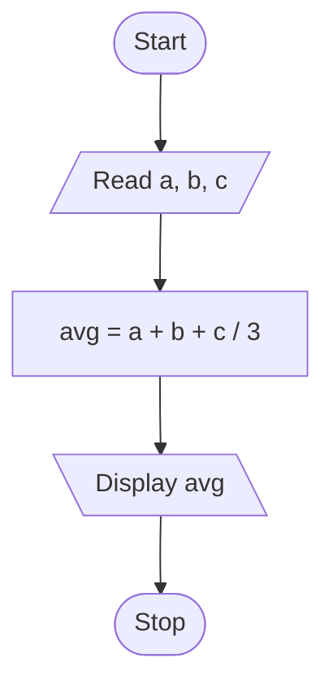
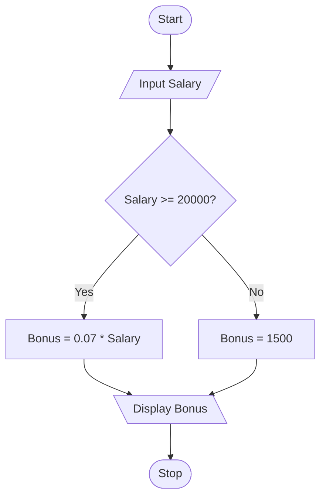
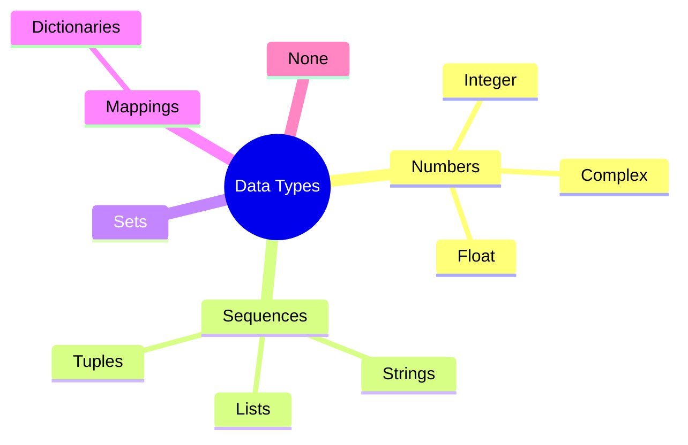

---
name: "cs-generator"
description: "Generate and upgrade computer science study notes (CBSE/board, Python-based, Class XI/XII level) in NoteBooks-Framework Markdown, across problem-solving & algorithms, Python fundamentals, control structures, functions, strings/lists/tuples/dictionaries, file handling, data structures, databases & SQL, computer networks, and Boolean algebra & logic gates. Self-contained: Markdown/callout/code-block conventions, Mermaid flowcharts and classification diagrams, self-contained SVG and TikZ figures (memory/reference diagrams, arrays, stacks, logic gates, trees), and interactive Desmos complexity-growth graphs are all built in -- no other skill needs loading alongside it. Covers pseudocode/flowchart conventions, syntax-vs-logical-vs-runtime error discipline, tracing code instead of inventing output, and reconciling two textbooks with different structure. Use whenever the user asks to create, upgrade, extend, or gap-fill CS notes -- even without saying 'cs-generator'."
---
# CS Notes Generator

A complete, standalone skill for producing NoteBooks-Framework Markdown computer science notes -- covering problem-solving & algorithms, Python fundamentals, control structures, functions, data structures, databases, networks, and Boolean logic alike. Everything needed is in this one file: the renderer contract, writing and callout conventions, code/pseudocode conventions, Mermaid flowcharting, self-contained SVG and TikZ figure patterns, and interactive Desmos graphing, plus CS-specific pedagogy and accuracy discipline. No other skill file needs to be read alongside this one.

## Renderer Contract

The NoteBooks renderer supports: ordinary Markdown (headings, paragraphs, emphasis, links, images, ordered/unordered lists, task lists where available), tables, blockquotes, fenced code blocks with syntax highlighting, footnotes, subscript/superscript, LaTeX math, and Obsidian-compatible conventions (including `[!type]` callouts).

**Mermaid** (fence tag exactly `mermaid`) and **TikZ via TikZJax** (fence tag exactly `tikz`) both render live in the current build. **SVG** (fence tag exactly `svg`) is being wired into the same fence whitelist -- once it's live, verify with one throwaway `svg`-fenced block before relying on it for a whole chapter. **Desmos** (fence tags `desmos` for 2D, `desmos3d` for 3D) is *not yet confirmed live* -- verify the same way before relying on it.

**Never screenshot an IDE, terminal, shell, or dialog window -- this isn't a placeholder-needing gap, it's simply the wrong tool.** A picture of Python Shell showing `>>> print("Hello")` teaches nothing that a `python` code block plus its output as text doesn't teach better: the text version is copyable, searchable, and exactly reproducible, which a screenshot isn't. Show real code and real (traced or executed) output as fenced text instead, and describe UI steps (menu → option, a keyboard shortcut) as a numbered list rather than showing the menu.

Never use embedded scripts or arbitrary classes/CSS variables to simulate presentation in an SVG -- see *SVG Diagrams* below. Never present an unverified or unavailable diagram type as if it were a rendered figure, and never invent a program's output -- trace it or run it.

## Writing, Layout, and Callout Conventions

- Start from the reader's question, not an unexplained formal definition. One primary idea per paragraph, short enough to scan.
- Headings form a meaningful, descriptive outline (`## Why input() always returns a string`, not `## Explanation`) -- never skip levels arbitrarily.
- **Bold** for terms being defined, *italics* for emphasis. Use `inline code` for every keyword, function name, identifier, and literal value mentioned in prose -- `print()`, `input()`, `num1`, `True` -- never plain text for these.
- Tables for comparisons, classifications, keyword/operator lists, and precedence tables. Numbered lists for algorithm steps and procedures; bullets for unordered facts.
- Blockquotes with a bold label for portable callouts, and Obsidian `[!type]` callouts for anything that should stand out visually:

```markdown
> **Key idea:** `input()` always returns a string, even when the user types a number.

> [!warning]
> `num1 = num1 * 2` on a string from `input()` repeats it ('22'), it doesn't double it numerically.

> [!example]
> ### Program 5-3 — Area of a rectangle (NCERT Program 5.3)
```

- Use callouts sparingly -- a note should not become a wall of colored boxes.
- Descriptive link text and image alt text; never "click here."
- Introduce an abbreviation once, then use it consistently.
- Preserve the source's meaning when improving prose -- never silently change facts, code behavior, or conclusions.

## Equations and Notation

Used sparingly in CS -- mainly for Boolean expressions and complexity analysis:

```markdown
Inline: \( O(n^2) \)

Display:

\[
Y = A \cdot B + \overline{A} \cdot C
\]
```

Explain every symbol that isn't obvious. Keep derivations stepwise, each a labeled display block, ending in `\boxed{...}` for a final simplified expression or bound. Keep delimiters balanced; never place diagram syntax inside a math fence.

## Code and Pseudocode Conventions

Python code blocks use the fence tag `python` for syntax highlighting. Pseudocode (no fixed syntax, English-like steps) uses the fence tag `text` -- forcing a language tag pseudocode doesn't match risks incorrect highlighting.

**Showing code and its output:** keep them as two separate fenced blocks -- a `python` block for the program, then a `text` block labeled `Output:` for what it prints. Never merge code and output into one block, and never invent output -- trace the code by hand, or actually run it, before writing down what it produces.

```python
length = 10
breadth = 20
area = length * breadth
print(area)
```

Output:

```text
200
```

**Pseudocode conventions** (matching common textbook usage): keywords in ALL CAPS -- `START`, `STOP`, `INPUT`, `DISPLAY`/`OUTPUT`, `SET`, `WHILE`, `FOR ... TO ... DO`, `REPEAT ... UNTIL`, `IF ... THEN ... ELSE ... END IF`. State the convention once if a source uses different keyword casing, and stay consistent with it for the rest of the note.

```text
START
SET total = 0
SET counter = 1
WHILE counter <= 10
    INPUT marks
    SET total = total + marks
    SET counter = counter + 1
END WHILE
SET average = total / 10
DISPLAY average
STOP
```

**Comments:** use `#` for inline Python comments, placed to explain *why*, not to restate *what* the line already says.

## Chapter Structure

Organize around the source's own logical order (concept before syntax, syntax before application), not reshuffled for narrative flair:

1. **Title + tagline** -- chapter name, **branch** (Problem Solving & Algorithms / Python Fundamentals / Control Structures / Functions & Modules / Strings, Lists, Tuples & Dictionaries / File Handling / Data Structures / Database & SQL / Computer Networks / Boolean Algebra & Logic Gates / Society, Law & Ethics), and target level (Class XI / Class XII / Board), since depth expectations differ.
2. **Concept Roadmap** -- one Mermaid flowchart mapping prerequisite → concept → application, dark-themed to match the renderer's palette.
3. **Numbered sections matching the source's own structure** (Section 1, 2, 3…; subsections X.Y). Preserve this numbering when upgrading an existing note.
4. **Quick Reference**, split by kind: a **keyword/syntax cheat-sheet** (reserved words, operators, precedence, function signatures) where the chapter is syntax-heavy; a **concept/definition table** (data types, error categories, symbol meanings) where it's more descriptive.
5. **Points to Ponder** -- the conceptual traps that actually cost marks: `input()` returning a string, `=` vs. `==`, off-by-one loop bounds, mutable vs. immutable confusion, mixing up syntax/logical/runtime errors.
6. **Problem-Solving Strategy** -- a short closing checklist per problem *type* (e.g. "Word problem → code: 1. identify inputs 2. identify the output 3. write the algorithm/pseudocode before code 4. trace it by hand once before trusting it").

Tag each section with difficulty/importance stars (⭐ to ⭐⭐⭐).

## The Worked-Example Pattern

**Computational** (write a program, trace output, evaluate an expression):

- **Given** -- the problem statement / starting code, restated cleanly.
- **Find** -- what the program should input, process, and output.
- **Approach** -- which construct applies, and why (e.g. "repeating with a known count ⟹ a `for` loop, not `while`").
- **Work** -- the code itself, as a `python` block (per *Code and Pseudocode Conventions*).
- **Check** -- trace it by hand (or run it) and show the actual output in a `text` block; does it match what the problem asked for?

**Conceptual** (differentiate two terms, categorize an error, explain *why*):

- **Given** -- the terms, code snippet, or scenario in question.
- **Find** -- the distinction, category, or explanation asked for.
- **Concept** -- the rule set applied (case-sensitivity, mutability rules, the syntax/logical/runtime distinction).
- **Work** -- reasoning shown step by step, not just an asserted answer.
- **Check** -- does the explanation match Python's actual documented behavior, not just intuition?

**Label every worked example by source**, so a student revising knows what's core syllabus vs. extra:

- `### Program 5-3 — Area of a rectangle (NCERT Program 5.3)` -- from the primary textbook, numbered to match it.
- `### Practice 5-9 — Debugging a type-conversion error (New)` -- added during gap analysis.

## Derivation Convention: General Case Before Special Case

When a source shows only a *worked instance* of a general technique (decomposing one specific quadratic-formula calculation without stating decomposition as a general problem-solving technique; a specific algorithm traced for one input array without stating the general algorithm first) -- **present the general technique or algorithm first**, then show the source's specific instance falling out of it. Don't present a worked example as if it were the whole lesson.

A student who only sees one traced example is stuck the moment the input changes. Showing "here's the general algorithm, and here's how it behaves on this specific input" builds the transferable skill. Number every derivation's steps, each labeled, ending in a boxed result where applicable.

## CS Accuracy and Consistency Checks

Don't inherit a source's confidence uncritically:

- **Trace every piece of code before showing its output** -- step through variable assignments by hand (or actually execute it) rather than guessing what a `print()` call produces. A wrong traced value is worse than an admitted gap.
- **Categorize errors correctly** -- a *syntax error* stops the program before it runs (a missing parenthesis); a *runtime error* stops it mid-execution (dividing by zero); a *logical error* lets it run to completion with a wrong answer (using the wrong formula). Don't call a logical error a syntax mistake or a runtime error a logical one -- the distinction is the entire point of teaching debugging.
- **Verify `print()` formatting claims against actual Python semantics** -- the default `sep` is a single space, the default `end` is `\n`, `+` concatenates strings but raises `TypeError` on mixed str/int without explicit `str()`/`int()` conversion.
- **Verify complexity claims** -- don't call an algorithm O(n) or O(n²) without actually counting operations relative to input size; if unsure, say so rather than asserting a specific bound.
- **Check identifier/keyword claims against Python's actual case-sensitivity and reserved-word list** -- `Print` is not `print`; `class` is a keyword and can't be used as a variable name.
- **Verify mutability claims for the actual type discussed** -- lists, sets, and dictionaries are mutable; strings, tuples, and numbers are immutable. Don't state a mutability claim by pattern-matching to a similar-looking type.

> [!warning] ⚠️ A real trap to avoid
> `input()` always returns a *string*, even when the user types a number. `num1 * 2` on that string repeats it (`'22'`), it doesn't double it numerically -- the code needs `int(num1) * 2` to get the arithmetic result. A note that shows the repeated-string output without explaining why teaches a misleading lesson.

## Notation and Terminology Discipline

Every time new syntax or a new concept is introduced:

- State which **Python version** the note assumes (e.g. "Python 3.x"), since syntax has changed across versions (`print` as a statement in Python 2 vs. a function in Python 3).
- Use **exact keyword casing** -- Python is case-sensitive; `True`/`False`/`None` are capitalized, `print`/`input`/`type` are lowercase.
- Pick one **identifier naming convention** (`snake_case` or `camelCase`) and state it if the source mixes styles, rather than silently normalizing everything.
- Distinguish **keywords** (reserved, can't be identifiers) from **built-in function names** (`print`, `len` -- technically reusable as identifiers, but flag doing so as bad practice) from **identifiers** the programmer chooses.
- Box or highlight every named error type, keyword list, or operator-precedence table so it's easy to find when scanning.

## Mermaid Diagrams

Use the fence tag exactly `mermaid`. Give every node a readable label, use arrows whose direction expresses the actual relationship, keep diagrams small enough to understand without zooming, and always follow a diagram with a sentence of interpretation. Treat labels and links as content, not executable code -- no arbitrary HTML, JavaScript, or unsafe URL payloads. Skip Mermaid where a table or short list is clearer.

**Mermaid `flowchart` is CS's home turf** -- it's built around the exact standard symbol set used in algorithm flowcharts:

| Standard symbol | Meaning   | Mermaid syntax          |
| --------------- | --------- | ----------------------- |
| Oval            | Start/End | `A([Start])`          |
| Parallelogram   | Input     | `B[/Read a, b, c/]`   |
| Parallelogram   | Output    | `C[\Display result\]` |
| Rectangle       | Process   | `D[Compute avg]`      |
| Diamond         | Decision  | `E{condition?}`       |

**Standard algorithm flowchart:**



**Decision flowchart** (branching logic, e.g. a conditional bonus calculation):



Use `flowchart` for algorithms, decision logic, and process flows (database ER relationships can use Mermaid's `erDiagram` type, network topology can use a plain `graph`). Use `mindmap` for non-sequential **classification** -- data-type hierarchies, mutable-vs-immutable breakdowns, topic overviews for revision:



## SVG Diagrams

Use the fence tag exactly `svg` for memory/reference diagrams, arrays/lists with indices, stack/queue visuals, and logic-gate symbols -- the default choice once confirmed live (see Renderer Contract), ahead of TikZ, because there's no parser layer between what's written and what renders.

> [!warning] ⚠️ Every SVG block must be fully self-contained
> Write literal values only -- hex colors (`#1565c0`), explicit `stroke-width`, `font-size`, `font-family` -- never a CSS class or a `var(--custom-property)`. The note's page won't have any stylesheet rules for an invented class or variable, so it will render unstyled or invisible even though the markup is valid. The colors below assume a light page background; adjust them if that isn't confirmed.

**1. Variable/object reference diagram** (how Python names bind to objects in memory -- adapt for shared references or reassignment):

```svg
<svg viewBox="0 0 420 200" xmlns="http://www.w3.org/2000/svg" style="max-width:100%;height:auto" font-family="sans-serif">
  <defs>
    <marker id="arrow" viewBox="0 0 10 10" refX="9" refY="5" markerWidth="6" markerHeight="6" orient="auto-start-reverse">
      <path d="M0,0 L10,5 L0,10 z" fill="#262626"/>
    </marker>
  </defs>
  <rect x="20" y="30" width="90" height="30" fill="#ffffff" stroke="#262626" stroke-width="1.5"/>
  <text x="65" y="50" font-size="13" fill="#262626" text-anchor="middle">num1</text>
  <rect x="20" y="110" width="90" height="30" fill="#ffffff" stroke="#262626" stroke-width="1.5"/>
  <text x="65" y="130" font-size="13" fill="#262626" text-anchor="middle">num2</text>
  <rect x="260" y="60" width="120" height="40" fill="#e3f2fd" stroke="#1565c0" stroke-width="1.5"/>
  <text x="320" y="85" font-size="14" fill="#1565c0" text-anchor="middle">300</text>
  <text x="320" y="30" font-size="11" fill="#757575" text-anchor="middle">id 1000</text>
  <line x1="110" y1="45" x2="255" y2="72" stroke="#262626" stroke-width="1.5" marker-end="url(#arrow)"/>
  <line x1="110" y1="125" x2="255" y2="85" stroke="#262626" stroke-width="1.5" marker-end="url(#arrow)"/>
  <text x="320" y="135" font-size="11" fill="#555555" text-anchor="middle">num1 and num2 both reference the same object</text>
</svg>
```

**2. Array/list with indices:**

```svg
<svg viewBox="0 0 220 90" xmlns="http://www.w3.org/2000/svg" style="max-width:100%;height:auto" font-family="sans-serif">
  <rect x="20" y="15" width="60" height="40" fill="#ffffff" stroke="#262626" stroke-width="1.5"/>
  <text x="50" y="40" font-size="13" text-anchor="middle" fill="#262626">10</text>
  <text x="50" y="70" font-size="11" text-anchor="middle" fill="#757575">[0]</text>
  <rect x="80" y="15" width="60" height="40" fill="#ffffff" stroke="#262626" stroke-width="1.5"/>
  <text x="110" y="40" font-size="13" text-anchor="middle" fill="#262626">20</text>
  <text x="110" y="70" font-size="11" text-anchor="middle" fill="#757575">[1]</text>
  <rect x="140" y="15" width="60" height="40" fill="#ffffff" stroke="#262626" stroke-width="1.5"/>
  <text x="170" y="40" font-size="13" text-anchor="middle" fill="#262626">30</text>
  <text x="170" y="70" font-size="11" text-anchor="middle" fill="#757575">[2]</text>
</svg>
```

**3. Stack (LIFO), showing push/pop end:**

```svg
<svg viewBox="0 0 200 220" xmlns="http://www.w3.org/2000/svg" style="max-width:100%;height:auto" font-family="sans-serif">
  <rect x="40" y="140" width="100" height="40" fill="#ffffff" stroke="#262626" stroke-width="1.5"/>
  <text x="90" y="165" font-size="13" text-anchor="middle" fill="#262626">10</text>
  <rect x="40" y="100" width="100" height="40" fill="#ffffff" stroke="#262626" stroke-width="1.5"/>
  <text x="90" y="125" font-size="13" text-anchor="middle" fill="#262626">20</text>
  <rect x="40" y="60" width="100" height="40" fill="#e3f2fd" stroke="#1565c0" stroke-width="1.5"/>
  <text x="90" y="85" font-size="13" text-anchor="middle" fill="#1565c0">30</text>
  <text x="150" y="80" font-size="11" fill="#1565c0">← top</text>
  <text x="90" y="200" font-size="11" fill="#555555" text-anchor="middle">last pushed, first popped</text>
</svg>
```

**4. Logic gate symbols** (AND shown; adapt the curve/add an output bubble for OR/NOT/NAND/NOR/XOR):

```svg
<svg viewBox="0 0 160 130" xmlns="http://www.w3.org/2000/svg" style="max-width:100%;height:auto" font-family="sans-serif">
  <path d="M 40 30 L 40 90 L 70 90 A 30 30 0 0 0 70 30 Z" fill="#ffffff" stroke="#262626" stroke-width="1.5"/>
  <line x1="10" y1="45" x2="40" y2="45" stroke="#262626" stroke-width="1.5"/>
  <line x1="10" y1="75" x2="40" y2="75" stroke="#262626" stroke-width="1.5"/>
  <line x1="100" y1="60" x2="130" y2="60" stroke="#262626" stroke-width="1.5"/>
  <text x="15" y="42" font-size="11" fill="#555555">A</text>
  <text x="15" y="72" font-size="11" fill="#555555">B</text>
  <text x="65" y="115" font-size="12" fill="#262626" text-anchor="middle">AND</text>
</svg>
```

**General rules:** every box/arrow/gate gets a label -- never color alone. One diagram per genuinely load-bearing idea. Always follow a figure with a sentence of interpretation. For data-structure trees (binary search trees, general trees), TikZ's automatic layout (below) is usually less tedious than hand-placed SVG coordinates.

## TikZ Diagrams

TikZJax still renders live and is the better choice specifically for **trees** -- its `child{}` syntax computes node placement automatically, which is genuinely less tedious than hand-computing coordinates for a binary search tree or a general tree with more than a few nodes. For everything else in this skill (memory diagrams, arrays, stacks, gates), SVG's lack of a parse step makes it the simpler default (see *SVG Diagrams* above).

Use the fence tag exactly `tikz`.

> [!warning] ⚠️ Renderer quirks that will silently break a figure
> `style=italic` is **not a valid TikZ key** -- use `font=\itshape\small` instead. Avoid `\foreach` -- write out repeated elements explicitly instead.

**Binary search tree**, via `child{}`:

```tikz
\begin{tikzpicture}[thick, scale=1.0, level distance=1.4cm,
  level 1/.style={sibling distance=3cm}, level 2/.style={sibling distance=1.6cm}]
  \node {50}
    child { node {30}
      child { node {20} }
      child { node {40} } }
    child { node {70}
      child { node {60} }
      child { node {80} } };
\end{tikzpicture}
```

## Desmos Interactive Graphs

Confirm Desmos actually renders here (see Renderer Contract) before relying on it. It earns its place over a static curve specifically when **interactivity adds understanding** -- most naturally, comparing how different time-complexity classes grow, or exploring how a specific algorithm's cost scales with input size. `desmos3d` is rarely needed in CS; reach for it only if a genuinely two-input-variable complexity relationship comes up. Skip Desmos entirely when a static figure already does the job. **One relationship per block.**

**Fence tags are exact and non-negotiable:** 2D state → ` ```desmos `, 3D state → ` ```desmos3d ` (one word, no hyphen). Get this wrong and the block fails silently or renders as plain code.

**Block format:** each line is one Desmos expression. A bare `name=value` line whose value doesn't depend on anything else automatically becomes a draggable slider.

**Pattern 1 -- Comparing time-complexity growth:**

```desmos
f\left(n\right)=n
g\left(n\right)=n\log\left(n\right)
h\left(n\right)=n^{2}
```

*Legend:* `f` = O(n), `g` = O(n log n), `h` = O(n²), all plotted against input size `n`.
*Try this:* compare how quickly each curve grows as `n` increases -- the quadratic curve overtakes the others fast, which is exactly why algorithm choice matters more as input size grows.

**Pattern 2 -- A specific algorithm's cost, exploring input size:**

```desmos
n=10
comparisons\left(n\right)=\frac{n\left(n-1\right)}{2}
```

*Legend:* `n` = input size (slider), `comparisons(n)` = total comparisons for an O(n²) algorithm like selection sort.
*Try this:* drag `n` and watch comparisons grow roughly with the square of `n`, not linearly.

**Verification -- what you can and can't check.** There is no local Desmos evaluator available. Verify the underlying complexity/maths independently before encoding it, do a static syntax review (exact fence tag, balanced `\left(`/`\right)`, one expression per line), and state plainly that syntax was reviewed but not executed.

## Working from a Primary Source + Supplementary Notes

CS notes are usually built from a textbook (NCERT, a CBSE-aligned board book, a syllabus PDF) plus a student's own coaching/handwritten notes.

- **Preserve the primary source's own section numbering**, and keep proposed changes distinguishable from settled note text.
- **Retrace, don't transcribe, every code output** -- rerun the logic by hand (or actually execute it) from the given code, rather than copying a printed output that might itself contain a typo.
- **Finish incomplete algorithms or pseudocode** -- a source that states a problem and shows only the final code, skipping the algorithm, is a gap to fill in the Algorithm section.
- **A textbook's own example can itself be incomplete** -- a multi-part exercise whose given solution only covers one part. Complete it, and note that you did.
- **Prefer the more general derivation when both a special-case and general-case source exist** (see *Derivation Convention* above).
- **When two sources cover the same ground with different structure or depth** -- one book folds problem-solving and Python basics into a single chapter, another splits algorithms into an earlier chapter and Python into a later one -- don't force one source's numbering onto the other. Pick the primary source's structure, and fold the supplementary source's unique content in as additional subsections or worked examples, labeled by which source they came from.
- **Never invent a citation, a claimed output, or a library's behavior** that wasn't actually given or independently verifiable.

## Branch Quick Guide

| Branch                               | Typical diagram                                                        | Notation/discipline to watch                                  |
| ------------------------------------ | ---------------------------------------------------------------------- | ------------------------------------------------------------- |
| Problem solving & algorithms         | Mermaid flowchart (standard symbols)                                   | precise, finite, unambiguous algorithm steps                  |
| Python fundamentals                  | Code + output blocks; SVG memory/reference diagram                     | case-sensitivity, string vs. numeric`input()`               |
| Control structures                   | Mermaid decision flowchart                                             | `=` vs. `==`, indentation defines blocks                  |
| Functions & modules                  | Mermaid call flow; SVG stack-frame diagram                             | parameter vs. argument, local vs. global scope                |
| Strings, lists, tuples, dictionaries | SVG array/list-with-indices diagram                                    | mutable vs. immutable, 0-based indexing                       |
| File handling                        | Mostly code + tables (modes, methods)                                  | always close or context-manage a file handle                  |
| Data structures                      | TikZ tree (`child{}` for BST/general trees); SVG stack/queue diagram | LIFO (stack) vs. FIFO (queue), push/pop vs. enqueue/dequeue   |
| Database & SQL                       | Tables for schema; Mermaid`erDiagram` for relationships              | primary vs. foreign key, exact SQL keyword casing             |
| Computer networks                    | Mermaid graph for topology                                             | bus/star/ring/mesh distinguished by actual connection pattern |
| Boolean algebra & logic gates        | SVG/TikZ gate symbols + truth tables                                   | AND/OR/NOT distinguished from NAND/NOR/XOR                    |
| Society, law & ethics                | Mostly tables + Mermaid classification                                 | descriptive content; a diagram is rarely load-bearing here    |

Revision-stage topic breakdowns, across any branch, use Mermaid `mindmap` (see *Mermaid Diagrams*) rather than a branch-specific diagram tool.

## Final Quality Checklist

- The title states the actual chapter, branch, and level; the note states which Python version it assumes.
- Every section carries a difficulty tag, and the roadmap reflects the note's actual structure (update it last, after content changes).
- Every code block was traced or verified, not invented; every Output block matches what the traced/executed code actually produces.
- Syntax, logical, and runtime errors are correctly categorized wherever discussed.
- Every named keyword, error type, or operator-precedence table is boxed/highlighted for scanning.
- No IDE, terminal, or dialog screenshot is used anywhere -- code + output as text, UI steps as a numbered list.
- Mermaid flowcharts use the standard shape set (stadium for start/end, parallelogram for input/output, rectangle for process, rhombus for decision); `mindmap` is used only for non-sequential classification.
- Every SVG block is self-contained: literal hex colors and explicit attributes only, never a `class=` or `var(...)`.
- Any TikZ tree figure follows `font=\itshape\small`, avoids `\foreach`, and is used specifically where automatic node layout helps (data-structure trees).
- Any Desmos block: exact fence tag, a legend before it and a "try this" line after it, and honest that syntax was reviewed, not executed.
- Worked examples are labeled by source (`NCERT X.Y` vs. `(New)`), and identifier/keyword casing matches Python's actual rules.
- Facts, code behavior, and source attributions were not invented or silently altered.
- The note remains useful in raw Markdown view, not just rendered view.
