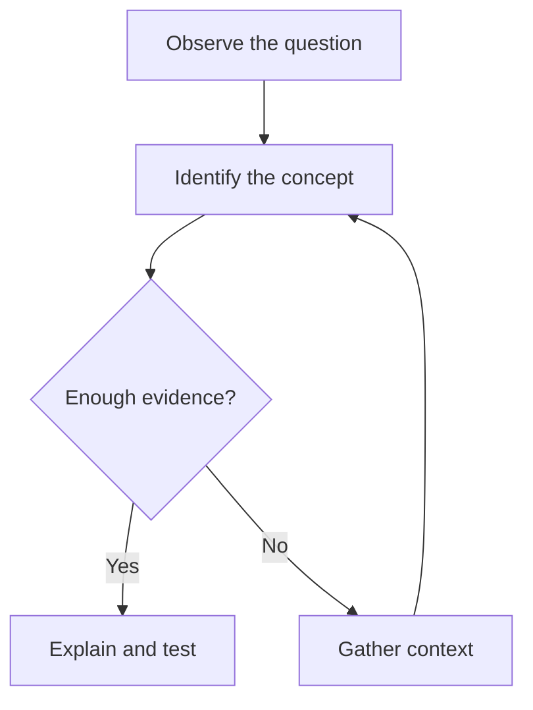
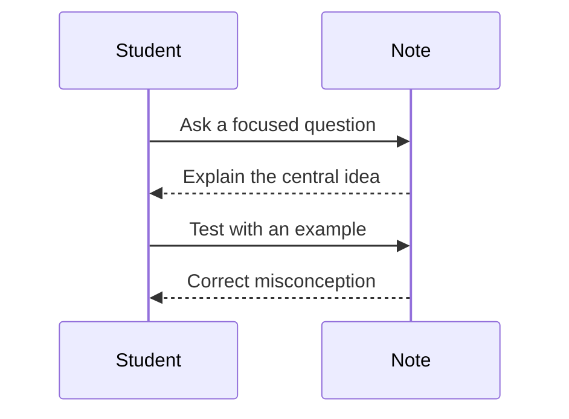

---
name: "notes-generator"
description: "This is NoteBooks Science Notes Creation Guideslies"
---
# NoteBooks Markdown Note-Crafting Skill

Create study notes that are clear on the first read, useful on revision, and pleasant to navigate. Prefer semantic Markdown over styling tricks. Preserve factual uncertainty, source context, and the distinction between rendered content and future placeholders.

## Renderer Contract

Write for the current NoteBooks renderer. It supports ordinary Markdown, headings, paragraphs, emphasis, links, images, ordered and unordered lists, task lists where available, tables, blockquotes, fenced code blocks, footnotes, subscript, superscript, LaTeX math, syntax highlighting, Obsidian-compatible conventions, raw Markdown viewing with line numbers, and source-aware “Suggest changes” workflows.

Use Mermaid, TikZJax, and Desmos as fully supported rendering languages -- render real content with each rather than describing what a diagram or graph would show. Do not claim that Bio/Chem diagram conversion is currently available; represent that one remaining future capability with an explicit placeholder block instead of fake output.

## Core Note Structure

Use this structure when it fits the subject. Omit sections that do not add value, but keep the progression from orientation to understanding to practice.

```markdown
# Topic: Specific, useful title

> One-sentence explanation of what this note helps the reader understand or do.

## At a glance

- **Subject:** ...
- **Level:** ...
- **Prerequisites:** ...
- **Key idea:** ...

## Learning goals

By the end of this note, the reader should be able to:

1. ...
2. ...
3. ...

## 1. The central idea

Explain the concept in plain language before introducing dense terminology.

## 2. Key concepts

### Concept A

Define the term, explain why it matters, and give a compact example.

## 3. How it works

Present the mechanism, derivation, process, or sequence in a logical order.

## 4. Worked example

Show the reasoning, not only the answer.

## Common misconceptions

> **Watch out:** State the tempting but incorrect interpretation and correct it.

## Summary

Restate the essential relationships in a few sentences.

## Check your understanding

1. ...
2. ...

## Further reading

- [Descriptive source title](https://example.com)
```

For revision-heavy subjects, add a compact “Exam memory” or “Quick recall” section near the end. For humanities, add context, chronology, competing interpretations, and evidence. For sciences, add definitions, assumptions, units, mechanisms, equations, diagrams, and limitations. For commerce, add formulas, transaction logic, tables, worked calculations, and interpretation of results.

## Writing and Layout Rules

1. Start with the reader’s question, not an unexplained formal definition.
2. Use one primary idea per paragraph. Keep paragraphs short enough to scan.
3. Use headings as a meaningful outline. Do not skip randomly from `##` to `####`.
4. Make headings descriptive: prefer `## How enzymes lower activation energy` over `## Explanation`.
5. Use bold for terms being defined and italics for emphasis or notation. Do not make entire paragraphs bold.
6. Use tables for comparisons, classifications, symbol glossaries, timelines, and formula summaries. Keep table cells concise.
7. Use numbered lists for procedures, derivations, and ordered reasoning. Use bullets for unordered facts.
8. Use blockquotes for definitions, warnings, source excerpts, and memorable principles. Identify quotations accurately.
9. Put long equations, algorithms, and multi-line examples in fenced blocks when inline math would be hard to read.
10. Add whitespace around major sections. Avoid decorative separator lines unless they clarify a genuine section boundary.
11. Do not use raw HTML, inline CSS, embedded scripts, or arbitrary classes to simulate presentation.
12. Do not encode important meaning only through color, emoji, indentation, or diagram placement.
13. Use descriptive link text and useful image alt text. Do not use “click here”.
14. Keep terminology consistent. Introduce an abbreviation once, then use it consistently.
15. Preserve the source’s meaning when improving prose. Do not silently change facts, units, dates, quotations, or conclusions.

## Approachable Explanation Pattern

For each difficult idea, use this sequence when appropriate:

1. **Plain-language intuition:** explain what is happening without specialist vocabulary.
2. **Formal definition:** state the precise meaning.
3. **Representation:** provide an equation, table, code block, or Mermaid diagram.
4. **Worked example:** apply the idea to concrete values or a real situation.
5. **Boundary:** state assumptions, exceptions, limitations, or common failure modes.
6. **Recall prompt:** ask one question that tests understanding rather than recognition.

Use analogies only when their limits are stated. Never let an analogy replace the formal definition.

## Callouts and Emphasis

Use blockquotes with a bold label for portable callouts:

```markdown
> **Key idea:** A catalyst changes the rate of a reaction without changing the overall equilibrium position.

> **Watch out:** Correlation describes association; it does not by itself establish causation.

> **Try it:** Predict the result before reading the worked solution.

> **Source note:** This interpretation depends on the stated historical context.
```

Use callouts sparingly. A note should not become a wall of colored boxes or warnings.

## Equations and Notation

Use LaTeX delimiters supported by the renderer:

```markdown
Inline: \( a^2 + b^2 = c^2 \)

Display:

\[
\Delta G = \Delta H - T\Delta S
\]
```

Explain every symbol that is not obvious. Include units and sign conventions. Keep derivations stepwise:

```markdown
\[
\begin{aligned}
F &= ma \\
  &= (2\,\mathrm{kg})(3\,\mathrm{m\,s^{-2}}) \\
  &= 6\,\mathrm{N}
\end{aligned}
\]
```

Do not place unsupported diagram syntax inside an equation fence. Keep math delimiters balanced and avoid relying on raw HTML for alignment.

## Mermaid Diagrams

Use Mermaid fully and deliberately for flowcharts, process maps, timelines, state diagrams, mind maps, relationship diagrams, class diagrams, and simple sequence diagrams. Always use a fenced block whose language is exactly `mermaid`:

````markdown

````

Mermaid guidance:

- Give every node a readable label.
- Prefer short node text and put detail in surrounding prose.
- Use arrows whose direction expresses the actual relationship.
- Use a decision node only when the process truly branches.
- Keep diagrams small enough to understand without zooming.
- Follow each important diagram with a short reading guide or interpretation.
- Use valid Mermaid syntax and avoid arbitrary HTML, JavaScript, or unsafe URL payloads.
- Do not use a diagram where a two-column table or list would be clearer.
- For timelines, keep dates in chronological order and state the time scale.
- For causal diagrams, distinguish correlation from causation in the prose.

Example sequence diagram:

````markdown

````

The renderer uses a strict Mermaid security posture. Treat labels and links as content, not as a place to execute code.

## TikZJax Diagrams

Use a fenced block whose language is exactly `tikz` for precise, static, geometrically-accurate figures -- true proportions, true angles, true curves, anything a diagram must get *exactly* right rather than approximately right:

````markdown
```tikz
\begin{tikzpicture}
  ...
\end{tikzpicture}
```
````

General rules:

- Every curve, region, vector, or angle gets a color **and** a label -- never color alone.
- Follow every figure with a sentence of interpretation, not just the image.
- Coordinates must be numerically accurate to what they represent -- if a figure implies two lengths or angles are equal, the coordinates must actually produce that.
- Use TikZ for a figure that needs to look a specific, fixed way every time it's read. If the figure's point is watching something change (a parameter, a coefficient, a moving point), use Desmos instead.

The concrete figure patterns (number lines, function graphs, vectors, force diagrams, and so on) belong in the subject-specific skill (`maths-generator`, `physics-generator`, etc.), not here -- this section only owns the contract that TikZJax is live and the general rules above.

## Desmos Graphs

Use a fenced block whose language is exactly `desmos` for graphs meant to be explored rather than merely viewed -- a function family with a parameter, a transformation, an intersection or region a reader would want to see change:

````markdown
```desmos
{
  "expressions": [
    { "id": "1", "latex": "y=x^2" }
  ],
  "graphSettings": { "xmin": -10, "xmax": 10, "ymin": -10, "ymax": 10 }
}
```
````

The block content is a JSON object matching the Desmos Graphing Calculator's expression-list schema (`expressions`, each with an `id` and `latex`, plus optional `color`, `label`, or `hidden`; an optional `graphSettings` viewport). Treat this schema as the working default -- confirm it against the actual renderer implementation before relying on any field beyond `id`/`latex`/`graphSettings`, since it hasn't been verified against this renderer's parser the way the Mermaid and TikZ contracts have.

General rules:

- State the window/viewport bounds explicitly (`graphSettings`) rather than leaving them to an arbitrary default -- what's in frame is part of what the graph communicates.
- Label or color-distinguish every expression when more than one is plotted.
- Follow every graph with a sentence of interpretation, and state what a reader should notice if they move a slider or vary a parameter.
- Use Desmos only where interactivity or a live parameter genuinely adds understanding. A single fixed curve with no parameter to explore is still better served by TikZ or by an ordinary image.

## Future Diagram Placeholders

Use these exact styles until the corresponding renderer capabilities are implemented. Keep the explanatory text useful even when the visual is unavailable.

### Bio diagram placeholder

```markdown
> **Bio diagram placeholder — add in a later pass**
>
> Planned visual: `[describe the biological structure, pathway, or process]`.
> The reader should understand: `[state the relationship the final diagram must show]`.
```

### Chemistry experimental setup placeholder

```markdown
> **Chemistry diagram placeholder — add in a later pass**
>
> Planned visual: `[describe the apparatus, labels, flow, and safety features]`.
> Required annotations: `[list substances, conditions, measurements, and direction of flow]`.
```

TikZJax and Desmos are live (see the sections above) and should never use a placeholder -- render the real figure or graph.

Never present a placeholder as if it were a rendered figure. If a Mermaid approximation is used, label it as an approximation.

## Subject-Specific Patterns

### Mathematics and quantitative science

State variables, assumptions, units, and the target quantity before calculating. Separate the general formula from the substituted values. Include a sanity check and explain whether the answer is exact, approximate, bounded, or dimensionless.

### Biology and chemistry

Because specialized Bio/Chem diagrams are placeholders in the current renderer, explain structures and processes with labeled tables, ordered steps, equations where supported, and Mermaid only when it accurately expresses relationships. Add a placeholder for the future figure and preserve the prose explanation.

### Physics

Use a “Given / Find / Model / Work / Check” pattern. State coordinate conventions, sign conventions, approximations, and units. Use Mermaid for conceptual systems or process relationships, not for pretending to be a precision plot.

### Commerce and economics

Define each account, variable, or indicator before using it. Show transaction direction, formula inputs, units, period, and interpretation. Use tables for comparisons and Mermaid for process flows such as accounting cycles or decision paths.

### Humanities and social sciences

Separate event, context, interpretation, and evidence. Identify chronology and perspective. Distinguish primary evidence from later analysis. When interpretations differ, show them in a comparison table rather than presenting one contested view as unquestionable fact.

## Code, Data, and Tables

Use fenced code blocks with a language identifier when syntax highlighting is useful:

````markdown
```python
values = [2, 4, 6]
mean = sum(values) / len(values)
```
````

Explain what the code demonstrates and do not include credentials, tokens, private URLs, or executable payloads. For data tables, include units, a clear header row, and a note about rounding or missing values. Keep very wide tables split into smaller focused tables.

## Source-Aware Editing and Issue Suggestions

When a note is derived from an existing Markdown source:

1. Preserve the original heading and surrounding context when making a change.
2. Do not invent line numbers. Let the renderer’s raw view provide the authoritative source lines.
3. Keep proposed changes separate from the polished note text.
4. State the reason for a suggestion briefly and specifically.
5. Identify whether the issue is factual, explanatory, structural, typographical, accessibility-related, or stylistic.
6. Do not include secrets or private repository data in a suggestion.

Use this structure for a human-readable suggestion summary:

```markdown
> **Suggested change:** `[short description]`
>
> **Why:** `[specific reason this passage should change]`
>
> **Type:** factual / clarity / structure / accessibility / formatting
```

## Accessibility and Reading Comfort

Write for keyboard users, screen readers, mobile readers, and readers returning to the note later. Use meaningful heading order, descriptive links, text alternatives for images, readable table headers, and visible explanations of symbols. Avoid very long unbroken lines, unexplained abbreviations, dense paragraph walls, and information conveyed only by visual styling.

Every diagram must have an explanatory paragraph. Every important image must have useful alt text. If a visual is unavailable, the surrounding prose and placeholder must still communicate the intended learning objective.

## Final Quality Checklist

Before delivering a note, verify:

- The title states the actual topic and level where useful.
- The opening explains why the topic matters.
- Learning goals are concrete and testable.
- Definitions precede specialized use.
- Headings form a logical outline with no accidental level jumps.
- Equations have balanced delimiters, defined symbols, and units where relevant.
- Tables have headers and are not being used for decorative layout.
- Mermaid fences are valid, small, readable, and followed by interpretation.
- Bio/Chem content is clearly marked as a placeholder rather than falsely rendered; TikZJax and Desmos figures are real rendered content, not placeholders.
- Code fences identify the language and contain no secrets.
- Links have descriptive text and images have alt text.
- Facts, quotations, dates, and source meaning were not invented or silently altered.
- The note includes a summary and at least one active-recall question when appropriate.
- The result remains useful in raw Markdown view as well as rendered view.
- The note does not depend on color, emoji, unsupported HTML, or client-side scripts to convey meaning.
